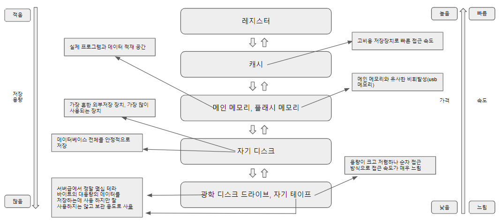

# 물리적 저장장치 구조

컴퓨터는 합리적 시스템 구성 비용과 가용 공간 및 접근 속도를 제공하기 위해 다양한 종류의 물리적
저장 장치를 계층적으로 구성한다.

일반적인 시스템에서 사용하는 물리적 저장장치들은 데이터 접근 속도를 기준으로 아래의 그림과 같이 분류될 수 있다.

아래의 그림에서 상위에 위치한 저장장치일수록 고가이지만 데이터 접근에 소요되는 시간은 짧은 반면, 하위 레벨에 위치할수록 저가이지만 데이터 접근에 소요되는 시간이 증가한다.

 저장장치는 기억 지속성 관점에서 휘발성 기억장치, 비휘발성 기억장치로 분류할 수 있다.
 휘발성(volatile) 기억장치는 전원 공급이 중단되면 기억장치 안의 모든 데이터가 소멸되는 특징을 갖고 있다.
 
 아래의 그림의 메인 메모리 이상의 상위 레벨은 휘발성 기억장치들이고, 하위 레벨은 비휘발성 기억장치이다. 비휘발성 기억장치는 주로 데이터를 보관하기 위한 용도로 사용된다.

