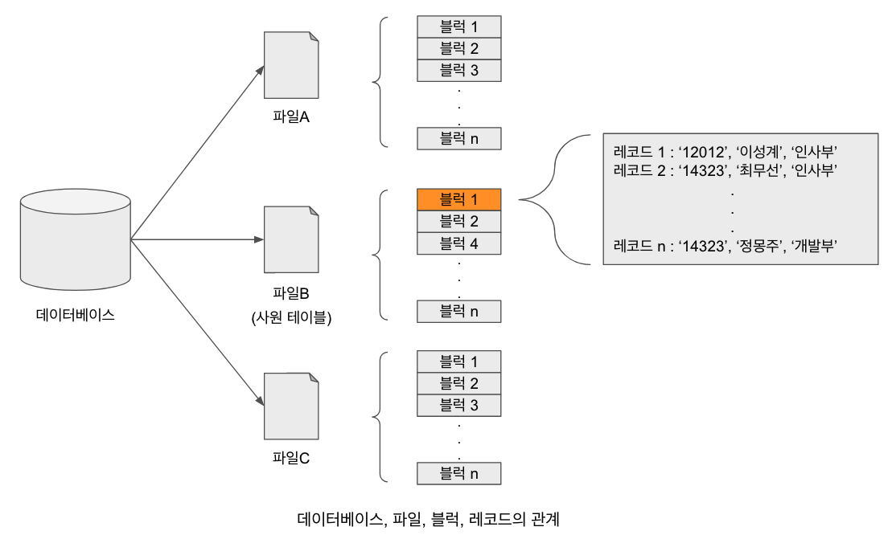

# 파일의 구성

DBMS는 데이터의 영구적 저장을 위해 운영체제가 제공하는 파일 시스템을 이용하며, 이를 통해 저장장치에 접근하고 파일에 저장된 데이터를 사용한다.
파일(file)이란 데이터를 영구적으로 저장하기 위해 사용하는 컴퓨터 시스템의 가장 기초적인 구조이다. 이러한 파일은 논리적 구조이기 때문에 물리적으로는 여러 개로 분할하여 저장될 수도 있다.
분할되더라도 사용자에게 제공될 때는 완전한 내용을 갖춘 형태로 재구성된다. 데이터베이스는 아래의 그림과 같이 여러개의 파일로 구성된다.

그리고 파일은 블럭(block: 일반적으로 메모리와 디스크간 데이터 전송 단위로 결정)단위로 분할되어 기록된다. 블럭이란 파일을 고정적 길이로 분할하여 생기는 균등한 크기의 데이터 묶음을 뜻한다.
예를 들어 블럭 하나의 크기가 4KB라고 할 때, 용량이 12KB인 파일은 3개의 블럭으로 나뉘어 저장된다. 이 파일 전체에 대한 읽기 요청을 처리하기 위해서는 파일을 구성하는 3개의 블럭을 디스크로부터 읽어 들여 메인 메모리에
적재해야 한다. 반대로 12KB 파일을 디스크에 기록할 경우, 메인 메모리에서 디스크로 3개의 블럭을 분할하여 전송한다. 블럭의 단위는 운영체제가 프로그램(즉 사용자)에 데이터를 전달하기 위해 디스크에서 메모리로 적재(페이징 인)하는
최소한의 기본 단위이다. 일반적으로 우리가 사용하는 PC의 경우 블럭의 크기는 4KB로 구성된다.

여러 개의 블럭이 하나의 파일을 구성하는 것과 같이 하나의 블럭은 다시 여러 개의 레코드로 구성된다. 하지만 상황에 따라 한 레코드가 블럭의 크기보다 커서 여러 블럭에 나뉘어 저장되는 경우가 있다. 관계형 모델에서 레코드는
더 이상 분리되어 저장되지 않는 최소 데이터 저장 단위로, 논리적으로 연관되어 있는 데이터 집합이다. 예를 들어, 한 사원 테이블이 사번, 이름, 부서명이라는 속성으로 구성되는 경우 각 레코드는 3개의 속성값으로 이루어지며, 여러 레코드가
묶여 한 개의 블럭에 저장된다.

이러한 파일, 블럭 및 레코드 간의 계층적 관계에서 DBMS가 레코드 저장을 위해 파일, 블럭, 레코드 수준에서 개별적으로 고려해야 할 여러 가지의 사항이 있다.
우선 레코드는 모든 레코드의 길이가 동일한 고정 길이 레코드와 레코드마다 길이가 다른 가변 길이 레코드 두 가지 유형이 있다. 한 블럭에 다수의 레코드가 포함될 때 어떠한 고려가 필요한지 생각해보아야 한다.

데이터베이스를 컴퓨터에 저장을 하려면 실제 컴퓨터는 물리적인 자기 디스크로 이루어져 있기 때문에 이 자기디스크에 데이터베이스를 저장하기 위해서 물리적 구조로써 변환을 해야 한다.
그래서 여러 단계의 변환 과정을 거치는데 이 하나의 데이터 베이스는 우리가 보기에는 전체 큰 하나의 데이터 집합으로 보이지만 데이터를 저장 하기 위해서 운영체제가 지원하는 가장 논리적인 데이터 저장 구조 중에서
가장 낮은 단계 즉 우리가 알고 있는 파일로써 구성이 된다.

즉 운영체제는 파일 시스템을 가지고 이 파일 시스템에서 여러 개의 파일 단위로 데이터를 관리 하는데 물론 이것도 물리적인 단위가 아니고 논리적인 단위인데
운영체제 위에서 동작하는 DBMS가 데이터를 운영체제가 관리하는 파일 시스템에 맞게끔 파일로 변환해서 가지고 있는 것이다. 그래서 여러개의 파일로 하나의 데이터베이스가 구성된다 라고 할 수 있다.

만약 어떠한 파일(파일A, 파일B, 파일C 등등..)이 실제 자기 디스크라 던가 테이프 등에 저장이 되려면 다시 그 저장장치가 물리적인 특성에 의해 가지고 있는 가장 작은 데이터 단위로 분리가 되는데 그걸 바로 우리가 블럭이라고 한다.

이 블럭 단위 부터는 물리적인 단위로 볼 수 있는데 즉 하나의 파일은 디스크에 저장 될 때 여러개의 블럭으로 분리가 되어서 저장이 된다. 그리고 이 하나의 블럭에 여러개의 레코드가 들어가는 그런 구조가 바로 하나의 데이터베이스가 디스크에 저장되는 구조다.

