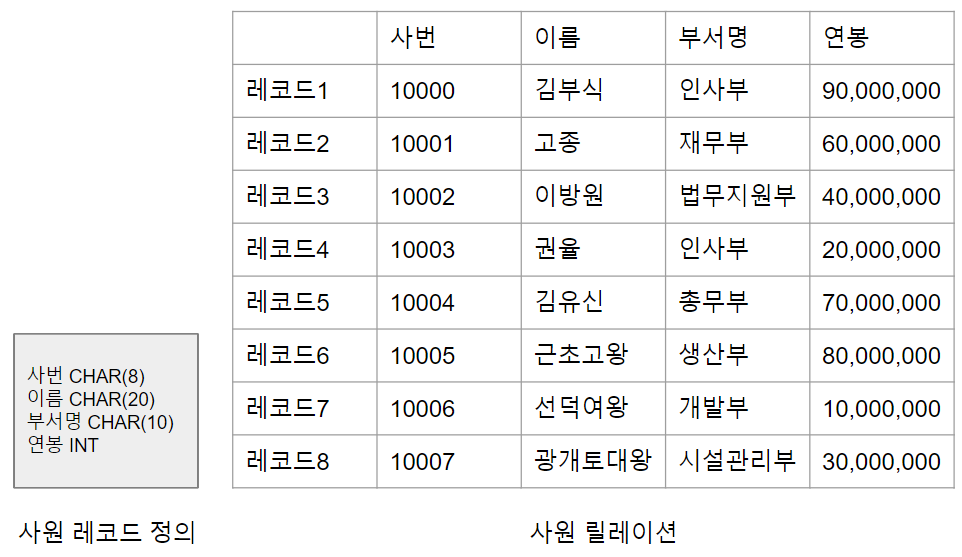
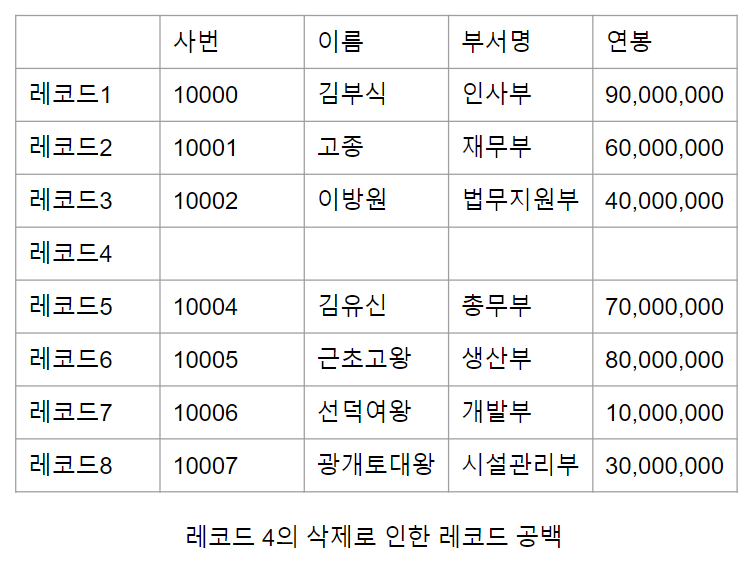
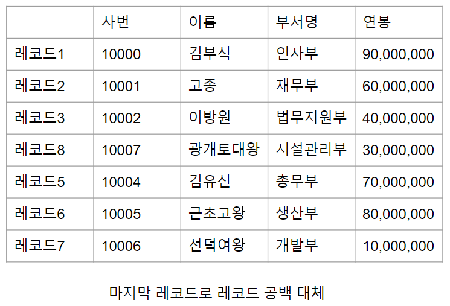
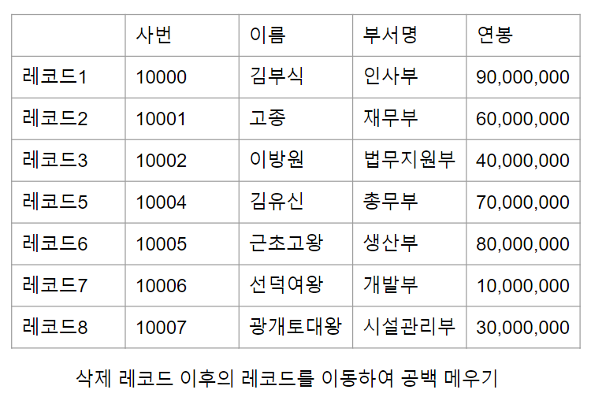
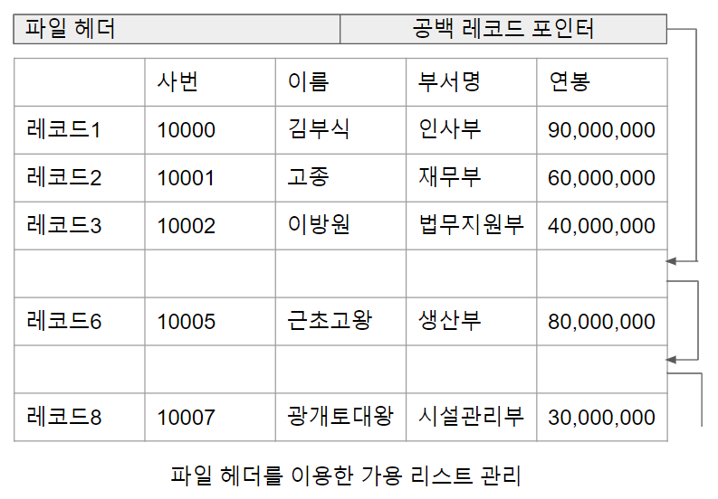

# 고정 길이 레코드

한 릴레이션 내부에 존재하는 모든 레코드의 길이가 항상 동일한 것을 고정 길이 레코드라 한다.
고정 길이 레코드(fix length records)방식은 각 레코드에 고정적인 바이트 수를 할당하는 방법이다. 예를들어 어떠한 기업의 데이터베이스에 사원 정보를 관리하기 위해 [사원레코드의정의와구성.png]과 같이 사원 레코드의 구조를 정의하고 릴레이션을 구성한 상황을 가정해 보자.

사원 레코드의 정의 구조상 모든 레코드의 길이가 동일하기 때문에 각 레코드에 대해 42바이트씩 할당한다. 만약 어떠한 블럭 내에서 세번째 사원 레코드를 읽고 싶을 경우 앞 2개의 레코드 길이84바이트(42바이트 x 2)를 건너뛰고 85번째 바이트부터 42바이트를 읽어 들이면 된다.

[사원레코드의정의와구성.png]
-------------------------------

고정 길이 레코드는 구현이 단순하고 탐색 방법이 매우 직관적이나 다음 두가지 관점에서 추가적으로 고려해야 할 사항이 있다.

1. 블럭의 길이가 레코드 길이로 정확히 나뉘어 떨어지지 않는다면, 어떤 레코드들은 2개의 블럭에 나뉘어 저장되어야 한다. 레코드를 한 블럭에만 저장하는 시스템이라면 블럭 내의 남은 공간은 공백으로 남김으로써 공간을 낭비하게 된다. 레코드를 두 블럭에 나누어 저장하는 것을 허용하는 시스템인 경우 하나의 레코드를 읽거나 쓰기 위해 2개의 블럭에 접근해야 하는 상황이 발생하기 때문에 DBMS의 성능이 저하 된다. 이때 DBMS의 성능이 저하된다라는 말은 연산이 2번 일어남(I/O)

2. 레코드 삭제 작업 후 빈 공간에 대한 관리가 어렵다. [삭제로인한레코드공백.png]그림과 같이 특정 레코드가 삭제되었을 때 레코드가 저장되었던 자리에 빈 공간이 생성된다.

[삭제로인한레코드공백.png]
-------------------------------

공간 효율을 위해서는 이 공간을 다른 레코드로 대체해야 하기 때문에 [마지막레코드로공백대체.png] 그림과 같이 가장 마지막에 위치한 레코드를 빈 공간에 재할당 할 수 있다(나중에 검색 시 시간 오래 걸림)

[마지막레코드로공백대체.png]
-------------------------------

또는 삭제된 공간을 무의미한 문자로 채워놓는 방법을 취할 수도 있으나 저장 공간이 낭비된다. 레코드 삭제 시 발생하는 공간 낭비 문제를 해결하는 다른 방법으로 [삭제레코드이후레코드를이동하여공백메우기.png] 그림 처럼 삭제된 레코드 이후의 모든 레코드를 한 칸씩 위로 이동시키는 방법이 있다. 이 방법은 레코드의 순서를 훼손하지 않지만 많은 수의 디스크 입출력을 동반한다.

[삭제레코드이후레코드를이동하여공백메우기.png]
-------------------------------

여러 방법 중 DBMS가 레코드 삭제 시 삭제된 공간을 비워 두었다가 새로 삽입된 레코드를 빈 공간에 채워 넣는 방법이 더 많이 사용된다. 발생한 빈 공간을 표시하는 것만으로도 삽입 시 가용 공간을 찾는 것이 어려워지기 때문에 [파일헤더를이용한가용리스트관리.png] 그림과 같이 가용 공간을 관리하는 가용 리스트라는 추가적인 자료구조를 사용한다.

가용 리스트(free list)란 아직 사용되지 않았거나 기존 레코드가 삭제되어 비어 있는 공간에 대한 정보를 관리하는 자료 구조이다. 파일의 시작점에 있는 파일과 관련된 다양한 정보가 저장되는 파일 헤더(file header)에 가용 리스트 정보를 위치시킨다. 새로운 레코드 삽입 시 파일 헤더가 가리키고 있는 빈 공간에 레코드를 삽입하고, 두 번째 빈 공간의 주소를 파일 헤더에 저장한다. 만약 가용 리스트에 빈 공간이 없다면 파일의 맨 끝에 레코드를 삽입한다.

[파일헤더를이용한가용리스트관리.png]
-------------------------------

