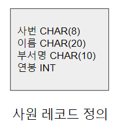
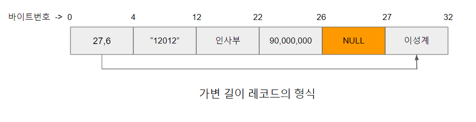
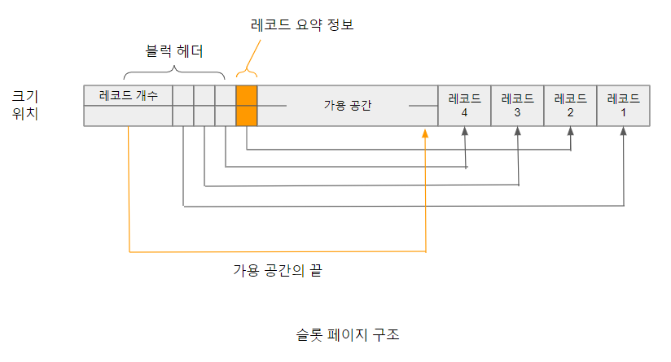

# 가변 길이 레코드

가변 길이 레코드(variable length records) 방식은 블럭에 저장되는 레코드의 길이가 서로 다를 때 레코드에 가변적인 길이를 할당하는 방법이다. 고정 길이 레코드는 각 레코드의 길이가 일정하기 때문에
구조가 간단하고 구현이 비교적 간편한 반면 가변 길이 레코드 방식은 각 레코드들의 길이가 동일하지 않기 때문에 고정 길이 레코드 방식보다 구조가 복잡하고 상대적으로 구현이 어렵다.
가변 길이 레코드 방식은 다음과 같은 상황에서 사용된다.

1. 한 블럭 내에 저장되는 레코드가 서로 다른 테이블의 것일 때
2. 길이가 고정되지 않은 컬럼의 개수가 하나 이상일 때
3. 레코드가 멀티셋(nultiset)을 허용하는 컬럼을 가질 때

멀티셋을 허용하는 컬럼이란 컬럼에 해당하는 값이 여러 개일 수 있는 경우를 뜻한다. 멀티셋을 지원하는 DBMS인 경우 사원(사번, 이름, 연락처)이라는 테이블에서 연락처가 여러 개인 사원을 위해 연락처 컬럼을 멀티셋으로
정의하여 복수 개의 값을 허용할 수 있다. 즉 사번이 "12012, 이성계, {(010-1111-2222), (010-4323-4353)}"와 같이 구성될 수 있다

가변 길이 레코드는 VARCHAR와 같은 가변 길이 컬럼을 한 개 이상 포함하는 레코드이다. 일반적으로 고정 길이 컬럼은 레코드의 앞쪽 부분에, 가변 길이 컬럼은 레코드의 뒤쪽 부분에 위치시켜 컬럼의 길이 변화에 필요한
작업을 최소화 한다. 가변 길이 레코드의 가장 첫 부분은 가변 길이 컬럼에 대한 위치 정보를 저장한다. 예를 들어 이름 컬럼에 대한 형식이 VARCHAR(n)은 최대 n바이트를 저장할 수 있는 컬럼을 나타낸다.

사번이 '12012'이고 연봉이 9000만원인 이성계에 대한 가변 길이 레코드는 [가변길이레코드의형식.png] 그림과 같은 형식으로 표현된다. 레코드 앞 부분의 (27, 6)은 27번째 바이트부터 6바이트가 가변 길이 컬럼인 것을 나타낸다.
'이성계'는 6바이트(한글 한 글자는 2바이트)에 해당한다. 복수의 가변 길이 컬럼인 경우에도 위와 같은 형식을 가진다. [가변길이레코드의형식.png] 그림에서 고정길이 컬럼과 가변 길이 컬럼들 사이에는 1바이트의 널 바이트가 추가되는데
두 유형의 컬럼을 구분해 주는 역할을 수행한다.

하나의 블럭에 여러 개의 가변 길이 레코드를 저장할 때, 고정 길이 레코드와 달리 각 레코드의 길이가 불규칙하기 때문에 각 레코드의 시작과 끝 위치를 나타내는 등 레코드의 접근 및 관리를 위한 별도의 자료 구조가 필요하다.
가변 길이 레코드를 저장, 관리하기 위해 사용되는 대표적인 구조로는 슬롯 페이지 구조(slotted page structure)가 있다. 블럭의 초반부는 블럭 헤더로 구성된다. 블럭 헤더는 블럭에 대한 요약 정보를 담고있다. 저장된 레코드 수,
각 레코드의 블럭 내 위치, 크기에 대한 정보를 가지고 있어 레코드를 빠르게 찾기 위해 사용된다. 또한 신규 레코드는 슬롯 페이지의 중간에 있는 가용 공간의 뒤쪽에서부터 저장되는데 이를 위해 블럭 헤더에 가용 공간의 끝에 대한
위치가 저장된다.

[슬롯페이지구조.png]

새로운 레코드들은 가용 공간의 끝 부분에서부터 역방향으로 저장된다. 헤더에는 각 레코드의 길이, 저장 위치 등 레코드의 요약 정보가 기록된다. 반면 레코드 삭제 시 해당 레코드가 차지하고 있던 공간이 반환된다.
이때 생성되는 빈 공간을 메우기 위해 삭제된 레코드 이전에 존재하는 모든 레코드의 위치를 당겨서 저장한다. 이 방법은 한 블럭 내 레코드들의 위치만 이동하기 때문에 많은 비용을 발생시키지 않는다. 블럭 내 레코드들의 위치가
조정된 후 레코드의 이동 상황을 블럭 헤더에 반영한다.