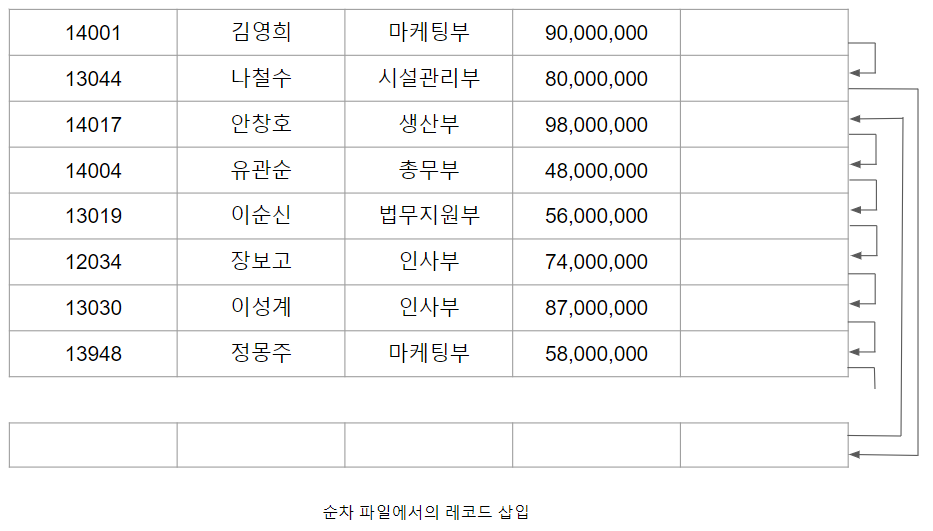

# 파일 구조

실제 데이터베이스 내의 파일은 수천, 수만여 개의 블럭의로 구성되기 때문에 더욱 복잡한 구조로 레코드를 관리한다. 특히 특정 레코드에 대한 접근을 위해 어떤 레코드가 어느 블럭에 저장되어야 하는지 관리할 필요가 있다. 이를 파일 구조(file organization: 파일 수준에서 레코드를 관리(순서 등)하는 방법)라고 하며, 파일 구조화 방법에는 다음 세가지가 있다.

1. 힙(heap)파일 구조 : 모든 레코드는 파일 내 임의의 블럭에 저장될 수 있는 방식으로, 각 
레코드들의 저장 순서를 고려하지 않는다. 즉 어느 블럭을 찾아 저장 하는게 아니라 그냥 무작위로 접근 해서 빈 공간이 있으면 저장을 하기 때문에 저장의 속도는 가장 빠르다. 하지만 특정 컬럼을 찾을 때 특정 컬럼을 찾아 메모리에 올려야 하는데 어디에 있는지 찾을 수 없다. 그래서 순차적으로 모든 블럭을 다 메모리로 올려 내가 찾고자 하는 컬럼을 찾아야 한다.(저장은 빠르지만 사용의 효율은 떨어진다.)

2. 순차(sequential)파일 구조 : 레코드들이 특정 컬럼에 대한 값을 기준으로 정렬되어 저장되는 방식으로, 일반적으로 정렬키로 탐색키를 사용한다.(저장 속도는 떨어지지만 검색은 빠르다.)

3. 해시(hash) 파일 구조 : 해시 함수를 이용하는 방식으로, 해시 함수는 레코드 탐색키를 입력받아 레코드가 저장될 블럭 주소를 반환하고 해당 주소에 레코드를 저장한다.

일반적으로 DBMS는 테이블의 물리적 구현이 상대적으로 쉬운 순차 파일 구조나 해시 파일 구조를 사용하여 테이블을 구현한다.순차 파일 구조로 레코드가 저장되는 순차 파일에서는 [사원명(탐색키)순으로정렬된사원테이블에대한순차파일.png]과 같이 레코드가 탐색키(search key) 순서대로 정렬되어 저장된다.

순으로정렬된사원테이블에대한순차파일.png)

탐색키는 테이블의 컬럼 또는 컬럼의 집합으로 구성될 수 있으며, 반드시 기본키일 필요는 없다. 각 레코드의 탐색키값 순서로 물리적 레코드를 정렬하여 생성되는 파일을 키 순차 파일(key sequence file)이라고 한다. 순차 파일에서의 레코드 접근은 레코드가 저장되어 있는 물리적 순서에 따르기 때문에 데이터 탐색 시 블럭의 접근 횟수를 최소화 할 수 있다. 또한 보다 빠른 접근을 위해 포인터로 순차적으로 연결한 연결 리스트의 형태로 순차 파일을 구성할 수 있다.

순차 파일의 장점
1. 탐색키에 대한 정렬 연산이 불필요하므로 정렬된 키 값들의 순서로 레코드를 판독하는 연산이 효율적이다.
2. 현재 레코드에서 정렬된 키 순서로 다음 레코드를 찾을 때 부가적인 블럭 접근을 필요로 하지 않는다.
3. 탐색키로 사용된 컬럼의 값을 기반으로 탐색을 할 때 이진 탐색을 사용하면 원하는 레코드를 더 빠르게 검색 할 수 있다. (이미 정렬되어 있는 상태여서 더 빠른것)

순차 파일의 단점
1. 탐색키가 아닌 컬럼의 값을 이용하여 탐색하는 것은 비효율적이다. 임의 접근을 위해서는 선형 탐색을 사용하고, 비순차 컬럼의 순서대로 레코드에 접근하기 위해서는 파일을 비순차 컬럼 순으로 정렬한 사본을 별도로 만들어 사용해야 한다.
2. 레코드 삽입과 삭제 연산 비용이 크다.

레코드가 물리적으로 정렬된 상태로 유지되어야 하므로 레코드 삽입 시 순차컬럼값(탐색키)을 기반으로 삽입 할 블럭을 찾고 그 위치에 삽입 할 충분한 공간이 있으면 삽입을 완료한다. 만약 삽입 할 공간이 없다면 [순차파일에서의레코드삽입.png]과 같이 신규 블럭에 삽입하고 신규 레코드의 이전 레코드가 신규를 링크하고, 신규 레코드 다음 레코드를 신규 레코드가 링크하도록 포인터가 재조정된다. 이렇게 레코드 삽입을 위해 사용한 신규 블럭을 오버플로우 블럭(overflow block)이라고 한다.

