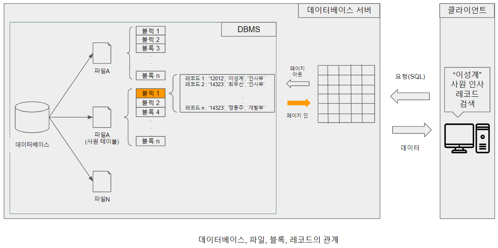

# 저장장치 접근

DBMS에서 관리하는 파일들은 영속성을 위해 보조기억장치인 디스크에 저장된다. 파일은 논리적 관점에서의 저장 단위이기 때문에 실제 저장될 때에는 여러 개의 물리적 단위로 분할되어 저장된다.
파일이 물리적으로 분할되는 단위는 블럭이며, 블럭의 크기는 시스템과 운영체제에 따라 다르지만 일반적으로 2KB, 4KB, 8KB, 16KB, 32KB가 자주 사용된다.

블럭은 디스크와 메인 메모리 사이의 기본 데이터 전송의 단위이기도 하며, 사용자에 의해 특정 레코드가 데이터베이스 서버로 전송 요청 시, 운영체제는 DBMS로 요청을 전달하고 DBMS는 요청에 포함된 조건을 파악하여 조건에 해당하는 레코드가 포함된 블럭을 찾는다.

DBMS는 찾은 블럭을 메인 메모리에 전송 및 적재하고 최종적으로 클라이언트에게 요청 레코드가 전달된다. [데이터베이스파일블럭레코드의관계.png]에서 클라이언트가 "이성계"사원 레코드 요청 시 DBMS는 파일 B의 블럭 1을 메모리에 페이지 인(적재)하고, 최종적으로 "이성계" 사원 레코드가 클라이언트에 전달된다.

이 과정에서 고려해야 할 사항은 일반적으로 디스크와 메인 메모리 사이에서 하나의 블럭이 전송되는 속도는 프로세서(CPU)의 연산 속도에 비해 매우 느리다는 점이다. 따라서 DBMS는 블럭 전송 횟수를 최소화 하여 입출력에 소요되는 시간을 단축하고 질의에 대한 반응 속도를 최소화할 필요가 있다.

블럭 전송 횟수의 최소화를 위해 메인 메모리에 사용 중인 블럭을 적재해 놓는 방법을 사용할 수 있다.
특정 파일에 접근할 때마다 디스크에서 블럭을 읽어 들이고 수정 내용을 곧바로 디스크에 기록하는 작업에는 오랜 시간이 소요된다. 따라서 사용 중인 블럭을 메모리에 적재시켜 놓고 메인 메모리 내에서 작업한다면 블럭 전송, 즉 디스크 입출력 횟수를 줄일 수 있다.

DBMS가 관리하는 데이터의 용량이 일반적으로 메인 메모리보다 월등히 큰 반면, 메인 메모리 용량은 유한하기 때문에 새로운 블럭 읽기 요청이 계속되면 블럭을 적재할 공간이 부족해질 수밖에 없다. 따라서 필요에 따라 특정 블럭 할당을 해지하여 새로운 공간을 만들기 위해 해당 블럭을 디스크에 기록해주는 기술이 필요하다. DBMS는 메모리 내부에 버퍼(buffer)라는 공간을 만들어 디스크로부터 가져온 블럭들을 저장하며, 하위 시스템인 버퍼 관리자(buffer manager)를 통해 버퍼를 효율적으로 관리하게 한다.

DBMS상의 프로그램이 필요한 블럭이 있을 때 버퍼 관리자에 해당 블럭을 요청한다. 만약 요청된 블럭이 이미 버퍼에 있다면 버퍼 관리자는 블럭이 위치한 메모리 내의 주소를 요청한 프로그램에 전달한다. 하지만 요청한 블럭이 버퍼에 없다면 버퍼 관리자는 요청한 블럭을 적재하기 위한 공간을 새로 할당한다.

이 때 버퍼에 새로운 블럭을 적재 할 공간이 없다면 블럭 할당 공간을 만들기 위해 버퍼에 있는 기존 블럭 하나를 선택하여 할당을 해지해야 한다. 선택된 블럭이 메모리에 적재될 당시와 동일한 상태의 블럭이라면 해당 블럭을 디스크에 재기록 할 필요가 없다. 반면 선택된 블럭이 수정된 적이 있다면 변경 내용을 반영하기 위해 디스크에 기록한다.

버퍼 관리자는 프로그램이 요청한 블럭을 디스크로부터 읽어 들인 후 새로 생긴 공간에 해당 블럭을 적재한다. 그리고 블럭이 적재된 메모리 주소를 프로그램에 전달한다. 버퍼 관리와 관련된 일련의 작업은 버퍼 관리자에 의해 추상화 되기 때문에 애플리케이션은 상세 내용에 대해 고려 할 필요가 없다. 버퍼 관리자는 여러 상황에 효과적으로 대응하기 위해 버퍼 교체 전략, 고정 블럭, 블럭 강제 출력 등의 기능을 수행한다.

- 버퍼 교체 전략(buffer replacement strategy) : 버퍼에 더 이상 가용 공간이 없을 경우, 새로운 블럭을 적재하기 위해 기존에 적재된 블럭 하나를 선택하여 할당을 해제해야 한다. 이때 어떤 블럭이 해제되어야 하는지 결정하는 알고리즘을 버퍼 교체 전략이라고 한다. 대표적으로 최근에 참조된 블럭은 다시 참조될 가능성이 높다고 생각하여 참조된 지 가장 오래된 블럭을 교체하는 LRU(Least Recently Used)전략과, 반대로 최근 참조된 블럭은 MRU(Most Recently Used)전략 등이 있다.

- 고정 블럭(pinned blocks) : 하드웨어 혹은 소프트웨어 결함으로 인하여 휘발성 기억장치의 데이터가 손실되어 작업이 중단될 경우, 중단된 작업의 중간 결과물이 디스크에 기록되는 것을 방지해야 한다. 이를 위해 임시적으로 디스크 블럭이 교체되는 것을 제한 할 필요가 있다. 복구 시스템은 블럭이 갱신되고 있는 동안에는 블럭이 교체되는 것을 제한하기 위해 특정 블럭을 고정시키는데, 이를 고정 블럭이라고 한다.

- 블럭 강제 출력(forced output of blocks) : 시스템 로그와 같은 중요한 데이터는 안정적인 시스템 운용을 위하여 디스크에 영구적으로 기록되어야 한다. 이러한 중요 블럭은 버퍼 공간이 부족하지 않은 상태임에도 필요에 따라 강제로 디스크에 기록되는데, 이를 블럭 강제 출력이라고 한다.