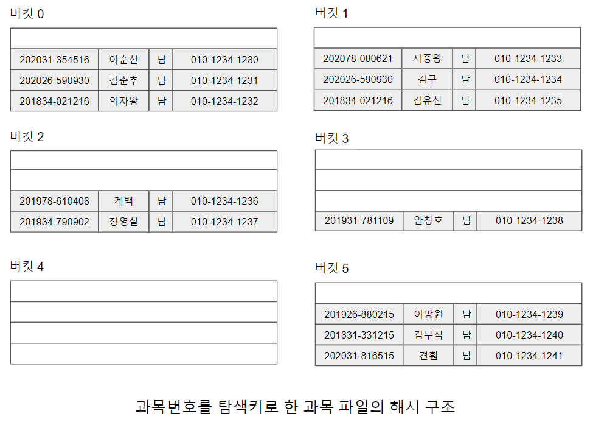
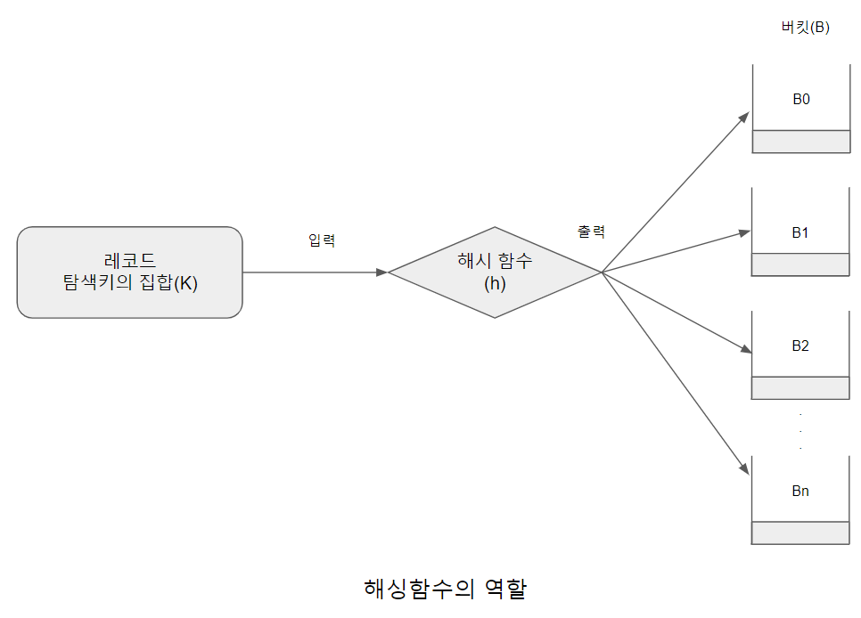
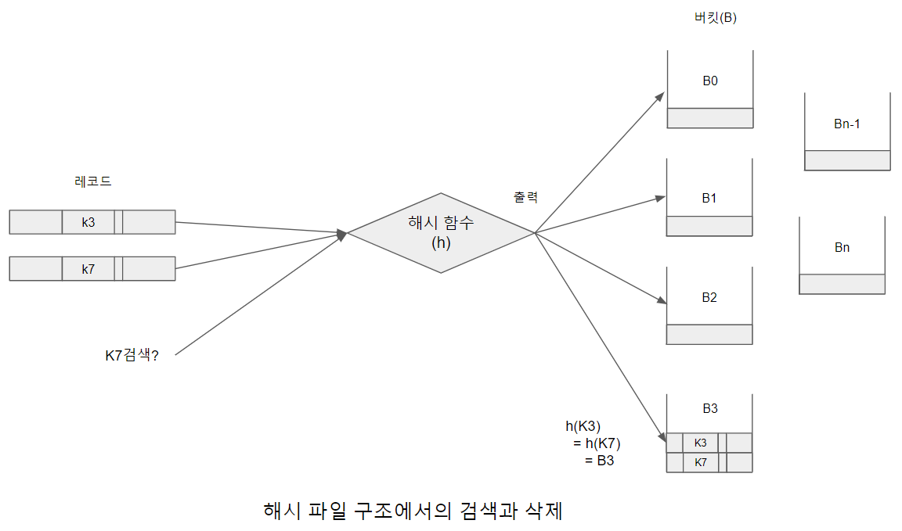

# 정적 해싱

해시 파일 구조에서는 삽입하려는 신규 레코드에 대한 디스크 블럭 주소를 레코드의 탐색키값에 계산 함수를 적용하여 직접 얻을 수 있다.
해시 파일 구조에서는 블럭 대신 버킷(bucket)이라는 용어를 사용하는데, 하나의 버킷은 한개 혹은 그 이상의 레코드를 저장 할 수 있는 저장 공간의 단위이다. 일반적으로 버킷의 크기와 디스크 블럭 크기를 동일하게 맞추지만 시스템에 따라 디스크 블럭보다 작거나 크게 선택하는 경우도 있다. [과목번호를탐색키로한과목파일의해시구조.png]는 학생 파일을 6개의 버킷에 해시 구조를 적용한 예를 나타낸다. 그림에서 학생 레코드는 편의상 학생번호, 학생이름, 성별, 전화번호 컬럼만으로 구성하였다.

[과목번호를탐색키로한과목파일의해시구조.png]

K를 모든 탐색키 Ki의 집합이라고 하고, B를 모든 버킷 주소 Bi의 집합이라고 하면, [해싱함수의역할.png]과 같이 해시 함수(hash function) h는 K를 B에 대응(mapping)시키는 함수이다. 만약 탐색키 Ki를 갖는 레코드를 삽입하려면, 해시 함수를 사용하여 h(Ki)를 계산해서 해당 레코드를 위한 버킷 주소를 구한 다음 레코드를 해당하는 버킷에 저장한다.

[해싱함수의역할.png]

[해시파일구조에서의검색과삭제.png]

탐색키 Ki를 갖는 레코드 검색도 비슷한 과정을 거친다. 하지만 [해시파일구조에서의검색과삭제.png]에서와 같이 탐색이 K3, K7을 갖는 서로 다른 두 레코드에 대해 해시 함수가 동일하게 B3의 주소를 결과값으로 반환하는 경우, 즉 h(K3) = h(K7), h(K3)와 h(K7)에 해당하는 버킷 B3에 두 레코드를 모두 저장하게 된다. 따라서 검색 시 고려해야 할 사항은 탐색키 K7이 검색 요청되었을 때 h(K7) = B3 버킷 내에 저장된 복수 개의 레코드를 조사하여 탐색키에 해당하는 레코드인지 판단하는 과정을 거쳐야 한다. 삭제를 할 경우에도 삭제되는 레코드의 탐색키값이 Ki라면, h(Ki)를 계산하여 해당 버킷 내에서 Ki를 찾고 그 레코드를 삭제한다.