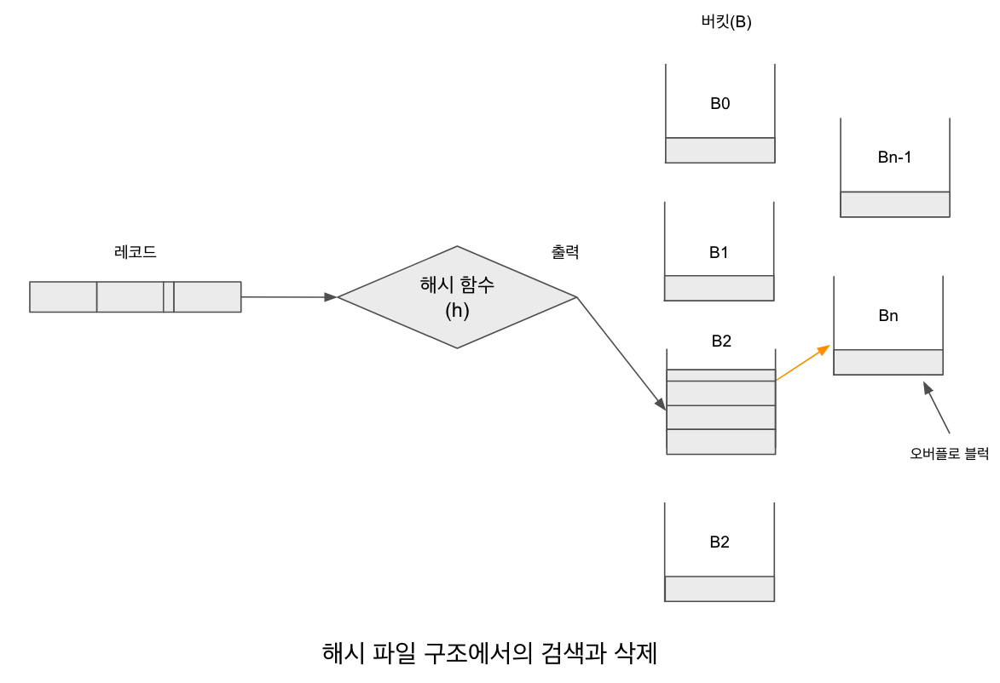

# 해시 함수

해시 함수는 탐색키를 이용하여 레코드를 버킷에 배분하는 역할을 한다. 즉 버킷의 ID를 결정해 주고 어느 버킷에 데이터가 저장 되어야 하는지 결정해 주는 역할을 한다. 그리고 버킷에 배분되는 레코드의 분포에 따라 해시 구조의 검색 성능은 많은 영향을 받기 때문에 해시 함수를 신중이 결정해야 한다.

이상적인 해시 함수는 저장된 탐색키를 모든 버킷에 균등하게 분배하여 동일한 수의 레코드를 갖게 한다. 이 경우 탐색키의 개수와 상관없이 상수 시간만큼의 평균 검색 시간을 보장 할 수 있다. 반면 최악의 상황은 모든 탐색키값이 같은 버킷에 대응되는 경우로, 모든 레코드가 한 버킷 안에 유지되기 때문에 순차 탐색과 성능이 차이가 나지 않는다. 즉 탐색키 수에 비례하여 검색 시간이 증가된다. 따라서 가능한 한 레코드가 균등하게 분배될 수 있도록 해시 함수를 설계 할 필요가 있다. 그러나 해시 함수 설계 시 탐색키값의 정확한 배분 분포는 알 수 없기 때문에 다음과 같은 방법으로 탐색키값을 버킷에 할당하는 해시 함수를 선택한다.

- 균등 분배 : 해시 함수는 모든 탐색키값의 집합으로부터 각각의 버킷에 같은 수의 탐색키값을 할당한다.
- 임의 분배 : 각 버킷은 거의 유사한 수의 탐색키값을 가지며, 순차적인 탐색키값에 따라 저장되지 않고, 레코드를 임의적으로 배분한다.

일반적으로 탐색키의 개수에 비해 버킷에 저장 할 수 있는 레코드의 개수가 많기 때문에 서로 다른 레코드가 같은 버킷으로 배분되는 경우가 발생한다. 이것을 충돌(collision)이라고 하며, 같은 버킷으로 배분된 레코드를 동거자(synonyms)라고 한다. 즉 충돌은 바로 동거자가 생성된다는 것을 의미한다.

레코드 삽입에서 충돌은 버킷에 자유 공간이 있을 때에는 문제가 되지 않지만, 버킷에 빈 공간이 없는 경우 오버플로(overflow)를 발생시키기 때문에 [해시파일구조에서의검색과삭제.png]와 같이 별개의 오버플로 버킷을 연결하거나 해시 함수에 지정된 버킷의 다음 버킷에 저장 할 수밖에 없다. 이는 검색 시, 오버플로가 발생한 버킷에서 검색하는 경우 추가적인 디스크 입출력을 유발한다. 따라서 충돌로 인해 오버플로가 많이 일어나게 되면 자연히 레코드의 접근 시간이 길어져 파일의 성능이 저하된다. 그러므로 해싱 기법에서는 충돌로 인한 오버플로를 어떻게 처리하느냐가 매우 중요한 문제이다.

[해시파일구조에서의검색과삭제.png]
