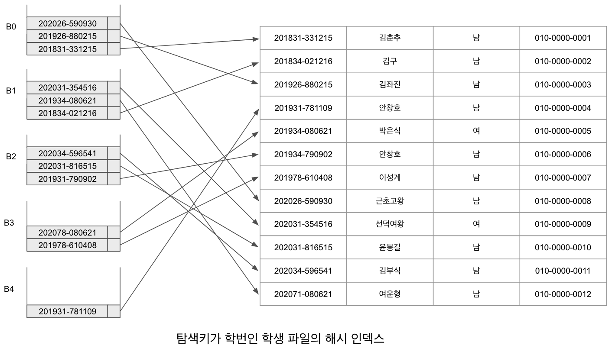

# 해시 인덱스

해싱은 파일 구조뿐만 아니라 인덱스 구조를 만들기 위해서도 사용된다. 이를 해시 인덱스라고 한다. 즉 해시 파일 구조와 동작 방식을 레코드가 아닌 인덱스 엔트리에 적용한 인덱스이다. 해시 인덱스는 해시 파일구조와 구성, 동작하는 방식이 유사하지만 레코드를 버킷에 저장하는 구조가 아닌 레코드에 접근 할 수 있는 탐색키와 포인터, 즉 인덱스 엔트리를 버킷에 저장하는 구조를 의미한다.

[탐색키가학번인학생파일의해시인덱스.png]는 탐색키가 학번인 학생 파일의 2차 해시 인덱스를 나타낸다. 그림에서는 5개의 버킷을 대상으로 해시 인덱스를 구성하였으며, 각 버킷의 크기는 3으로 가정하였다. 해시 함수는 학번끝자리 수 % 5로 적용했으며, 탐색키를 해시 함수에 적용하고 그 결과 버킷에 인덱스 엔트리를 저장하였다. 이 예(example)에서는 학번이 학생 파일의 기본키가 되므로 각 탐색키와 연관된 포인터는 단 한 개로만 구성된다.

김춘추, 김구 학생의 순서로 해시 함수에 학번을 순처적으로 적용하여 해당 학생 레코드에 인덱스 엔트리가 저장되었다. 윤봉길 학생의 경우 B0에 오버플로가 발생하여 B1에 저장하려고 했으나 B1에서도 오버플로가 발생하여 B2에 저장되었다. 그 결과 윤봉길, 김부식, 여운형 학생은 해시 함수가 나타내는 버킷이 아닌 다음 버킷에 저장되어 탐색 시 다른 레코드에 비해 더많은 시간이 소요된다.

[탐색키가학번인학생파일의해시인덱스.png]

정적 해싱의 문제점
1. 데이터베이스의 크기가 커짐에 따른 성능 감소
2. 미리 큰 공간을 잡을 경우 초기에 상당한 양의 공간을 낭비
3. 재구성시 새롭게 선택된 해시 함수를 사용하여 모든 레코드에 대하여 다시 계산하고 버킷에 할당되는 대량의 비용 발생.

이러한 문제점 때문에 해시 구조의 크기가 동적으로 결정되는 동적 해싱 기법 제안.