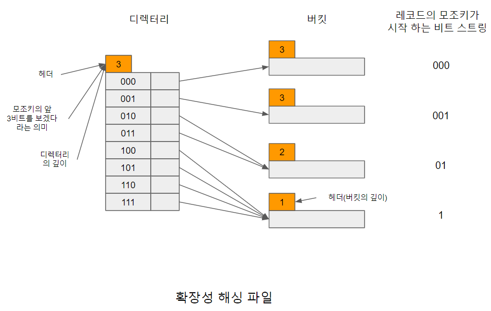
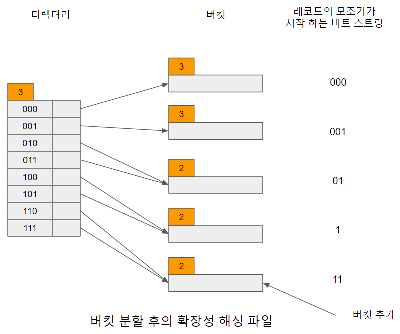

# 동적 해싱

대부분의 데이터베이스는 시간이 지나면서 점점 커지기 때문에 고정된 버킷의 주소 집합의 크기를 갖는 정적 해싱 기술에서는 아래의 세가지 선택에 따른 문제가 있다.

1. 해시 함수를 현재 인덱스 파일의 크기에 기초해서 선택한다. 이 선택조건은 데이터베이스가 커짐에 따라 오버플로 비율이 증가하여 성능이 감소할것이다.
2. 반대로 해시 함수를 미래에 증가가 예상되는 파일의 크기에 기초해서 선택한다. 이러한 방법은 성능 감소를 피할 수 있지만, 초기에 상당한 양의 공간이 낭비될 수 있다.
3. 마지막으로 파일이 커짐에 따라 주기적으로 해시 구조를 재구성한다.

세 번째의 해시 구조를 재구성하는 방법이 가장 합리적으로 생각되나 재구성에는 새로운 해시 함수를 선택하고 새로운 해시 함수로 파일에 있는 모든 레코드를 새로운 버킷에 할당해야 한다. 이런 재구성은 큰비용을 야기하며, 재구성하는 동안 인덱스 역할을 할 수 없는 추가적인 비용이 발생한다.

이러한 정적 해싱의 대안으로 가변적 구조를 갖는 동적 해싱(dynamic hashing)기법이 제안되었다. 동적 해싱은 데이터베이스의 증대 혹은 축소를 조절하기 위해 해시 함수가 상황에 맞춰 변경되는 것을 허용하는 구조이다. 그리고 우리는 이번 2-14에서 동적 해싱중 대표적인 기법인 확장성 해싱에 대해 알아볼것이다.

확장성 해싱은 데이터베이스가 지속적으로 증대/축소하는데 따른 문제에 대처하기 위해 제안된 기법이다. 확장성 해싱은 파일의 크기와 관계없이 한 번의 디스크 접근만으로 특정 레코드를 검색할 수 있다는 것을 보장한다.

확장성 해싱은 디렉터리(directory)라는 버킷 주소 테이블과 버킷으로 구성된 2단계 구조를 갖는다. 디렉터리는 디스크에 저장되는데, 디렉터리 깊이라는 정수값d(d의 일반적인 값은 32)를 포함하고 있는 헤더와 데이터 레코드가 저장되어있는 버킷에 대한 2d개의 포인터로 구성된다. 이때 이포인터값들은 모두 상이할 필요는 없다.

확장성 해싱 함수는 먼저 레코드의 키값(탐색키)을 일정 길이의 비트 스트링(bit string)으로 만드는데 이것을 모조키(pseudo key)라고 한다. 그리고 모조키의 처음 d비트가 디렉터리에 접근하는데 사용된다. 각 버킷에도 정수값 i(i <= d)가 저장되어있는 헤더가 있다. i는 그 버킷에 저장되어 있는 레코드의 모조키들이 처음부터 i비트까지 모두 동일하나는 것을 나타낸다. [확장성해싱파일.png]은 이 확장성 해싱 파일을 개념적으로 표현한 것이다.

[확장성해싱파일.png]

예를들어 키값(탐색키)이 k인 레코드를 [확장성해싱파일.png]의 해싱 파일에서 검색하기 위해 변환시킨 모조키가 101000010001이라고 가정하면, 먼저 디렉터리의 깊이가 3이므로 모조키의 처음 3비트(=d)를 이용하여 디렉터리의 여섯번째(101) 엔트리에 접근한다. 이 엔트리는 네번째 버킷에 대한 포인터를 가지고 있는데, 이 버킷이 바로 키값k를 가지고 있는 레코드가 저장되어 있는 곳이다.

해당 버킷의 깊이(i)는 1인데, 이것은 이 버킷에 저장되어 있는 모든 레코드 모조키의 처음 1비트가 모두 같다는 것을 나타낸다. 레코드를 저장 할 때도 먼저 그 레코드 모조키의 처음 d비트를 이용해서 디렉터리에 접근한 뒤에 그 포인터가 지시하는 버킷에 저장한다.

그러나 만일 버킷이 남은 공간이 없는 상태인 경우에는 바로 삽입 할 수 없다. 예를 들어 네 번째 버킷이 꽉찬 상태에서 모조키가 10으로 시작하는 레코드를 삽입하려고 한다면 우선 해당 버킷이 분할된다. 즉 비어 있는 버킷을 할당 받아 모조키가 11로 시작되는 모든 레코드를 새로운 버킷으로 이동시킨 다음에 원래의 버킷에 저장한다. 이때 디렉터리의 110과 111의 포인터값은 새로운 버킷을 지시하도록 변경되고, 분할된 버킷의 깊이는 [버킷분할후의확장성해싱파일png]과 같이 각각 2로 변경된다.

만일 첫 번째 버킷(000)이 포화상태에서 다시 레코드를 삽입하려고 한다면 버킷을 분할한다 하더라도 현재의 디렉터리로는 지시 할 수 없다. 이미 디렉터리 깊이(d)와 이 버킷 깊이(i)가 3으로 같고, 버킷 깊이 i는 디렉터리 깊이 d보다 커질 수 없기 때문이다.

이러한 경우에는 먼저 디렉터리 깊이를 하나 증가시켜 디렉터리를 확장시켜야 하는데, 이 경우 디렉터리의 크기가 배로 늘어난다. 즉 포인터 수를 두배로 만든 후에 빈 버킷을 할당받아 여기에 모조키가 0001로 시작되는 레코드를 이동시켜 처리한다. 이때 물론 디렉터리의 헤더와 버킷의 헤더에 있는 깊이 값이 하나찍 증가되고 포인터가 적절히 조정된다.

[버킷분할후의확장성해싱파일.png]

=> 정적 해싱에 비해서 새로운 단계가 추가 되어서 굉장이 느린것 같지만 전혀 아니다. 왜냐하면 디렉터리는 항상 메모리에 적재되어 있어서 별도의 디스크 I/O를 발생시키지 않으며 그리고 향후 오버플로우를 발생시키지 않는다 라는걸 감안하면 성능 저하에 영향을 미치지 않기 때문에 굉장히 자주 사용되는 해싱 기법이다.