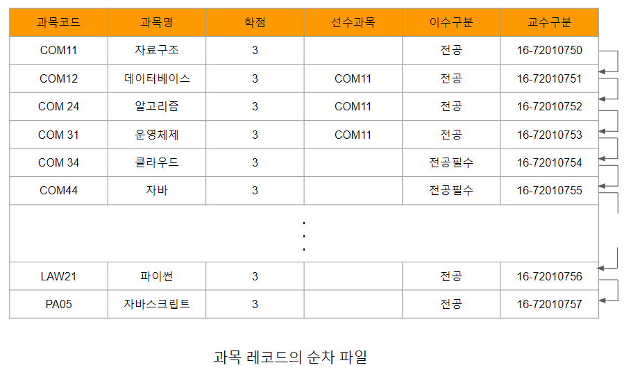

# 순서 인덱스

데이터가 정렬되어 있다는 의미의 순서 인덱스는 가장 기본적인 형태의 인덱스이다. 일반적으로 지정된 탐색키값으로 정렬된 순차 파일(
sequential file)에서는 데이터 레코드에 대한 빠른 임의 접근(random access)이 가능하도록 순서 인덱스를 사용할 수 있다.
이때 사용되는 순서 인덱스의 구조는 탐색키를 정렬하여 저장하고 해당 레코드와 연계시킨다.

모든 파일이 순차 파일로 되어 있다고 가정할 때 데이터 레코드는 특정 탐색키(일반적으로 기본키)순서로 정렬된다.
[과목레코드의순차파일.png]은 순차 파일의 예로 기본키인 과목코드에 의해 과목 레코드가 정렬된 것을 보여준다.

인덱스된 순차 파일은 순차적으로 정렬된 순차 파일과 각 레코드에 대한 포인터를 가지고 있는 순서 인덱스로 구성된다. 순차 파일은
레코드 집합 전체에 대한 순차 접근을 지원하는데 사용되며, 순차 인덱스는 어느 한 특정 레코드에 대한 직접 접근을 위해 사용된다.

이렇게 인덱스의 순서와 레코드가 저장된 순서가 동일한 인덱스를 클러스터드 인덱스(clustered index)라고 한다.
순차 접근과 직접 접근을 동시에 지원하는 방식은 영어사전의 경우를 살펴보면 이해하기 쉽다. 사전 옆면에 표시된 알파벳들은 순차적으로
정렬된 단어들의 순서 인덱스 역할을 한다. 예를 들면 "data"와 같은 단어를 찾을 때 일반적으로 사전을 처음부터 순차적으로 찾지는
않는다. 먼저 이 단어의 첫 번째 문자인 'd'를 보고 d로 시작하는 단어들이 시작되는 위치를 찾는다.

그 다음 단계에서도 마찬가지로 d로 시작한 단어 전부를 처음부터 하나씩 차례로 찾지는 않는다. 각 페이지의 처음과 마지막 단어를
표시한 페이지 헤딩을 이용하여 일단 이 단어가 있는 페이지를 찾은 다음에 그 페이지에서 원하는 단어를 순차적으로 찾아 나간다.