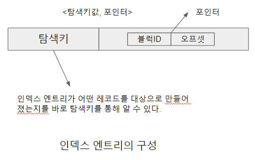
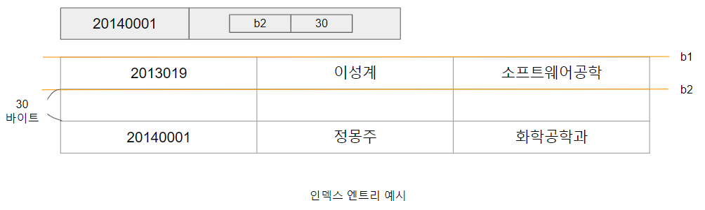
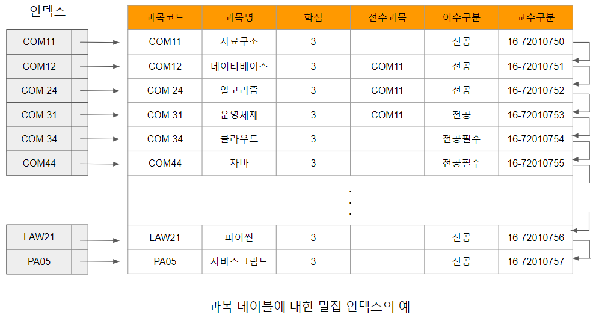
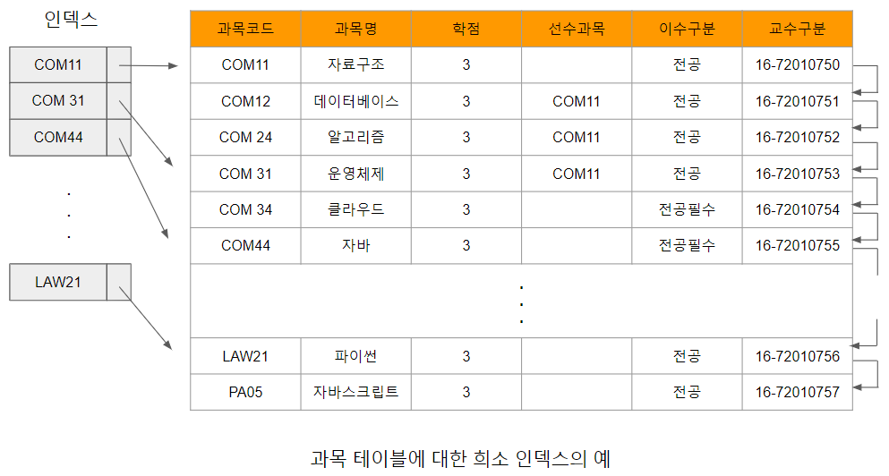

# 밀집과 희소 인덱스

순서 인덱스를 구성하는 인덱스 엔트리(index entry)는 <탐색키값, 포인터> 쌍으로 구성되며, 각각의 레코드에 대한 빠른 접근을 할 수 있는 값이다. 이때 포인터는 탐색키에 대응되는 한 개 이상의 레코드에 대한 포인터로, 데이터 레코드가 저장되어 있는 디스크 블럭의 식별자와 블럭 안에서 레코드의 위치를 가리키는 오프셋(offset)으로 구성된다.

[인덱스엔트리의구성.png]

[인덱스엔트리예시.png]

순서 인덱스는 인덱스 엔트리를 구성하는 수에 따라 밀집된 형태와 희소된 형태로 분류 할 수 있다. 밀집 인덱스(dense index)는 모든 탐색키값에 대해 인덱스 엔트리를 생성한다. 모든 레코드에 대해 <탐색키값, 포인터(블럭ID, 오프셋)> 쌍을 유지 즉 모든 레코드에 대해서 인덱스 엔트리를 구성하는 형태의 인덱스를 밀집 인덱스라 한다.[과목테이블에대한밀집인덱스의예.png]은 과목 파일에 대한 밀집 인덱스를 구성한 그림으로, 각 과목 레코드의 과목코드에 대한 인덱스 엔트리가 구성되어 있다. 따라서 이 인덱스의 탐색키는 과목코드라고 할 수 있다. 

[과목테이블에대한밀집인덱스의예.png]에서 인덱스 엔트리의 포인터는 -> 
를 사용 하여 간결하게 표현하였다. "COM31"인 과목의 레코드를 찾는다고 가정할 경우 과목 테이블을 메인 메모리로 읽어 조건에 해당하는 레코드를 찾기보다는 크기가 훨씬 작은 밀집 인덱스를 메모리로 읽어 "COM31"인 인덱스 엔트리를 찾은 후 레코드에 대한 포인터를 따라 데이터베이스 시스템에 접근하면 보다 빠르게 레코드를 찾을 수
있다. 즉 적은 양의 디스크-메모리 입출력(I/O)으로 질의 처리의 속도를 향상시킬 수 있는 것이 인덱스의 근본적인 사용 목적이다.

[과목테이블에대한밀집인덱스의예.png]

ex) COM31에 해당하는 과목명은 무었인가? 라는 요청이 들어오면 인덱스 엔트리가 I/O의 기본 단위 만큼 즉 블럭 만큼 차근차근 메모리에 적재되서 COM31을 찾을 때까지 계속 인덱스 엔트리를 메모리에 적재 한다. 이 COM31이 메모리에 적재되서 COM31에 대한 포인터를 가지고 오게 되면 실제 바로 이 해당 블럭을 메모리에 적재 하고 찾고자 하는 정보를 가져온다.

반면 희소 인덱스(sparse index)는 밀집 인덱스처럼 각 인덱스 엔트리가 탐색키값과 그 탐색키값에 해당하는 데이터 레코드에 대한 포인터 쌍을 갖는 것은 동일하지만, 파일의 모든 레코드에 대해 인덱스 엔트리를 생성하는 밀집 인덱스와 달리 [과목테이블에대한희소인덱스예.png]와 같이 일부의 탐색키값만을 대상으로 인덱스 엔트리를 생성한다.
[과목테이블에대한희소인덱스예.png]에서 나타나는 과목 파일에 대한 희소 인덱스를 이용하여 과목코드가 "COM44"인 과목의 레코드를 찾는다고 가정하자.

희소 인덱스에는 모든 탐색키가 존재하는 것이 아니기 때문에 찾고자 하는 탐색키보다 작거나 같은 값중에서 가장 큰 키값을 찾는다. [과목테이블에대한희소인덱스예.png]에서 "COM31"이 이에 해당하는 키값이므로 이 인덱스 엔트리의 포인터를 따라 데이터베이스 시스템에 해당하는 레코드를 찾은 후 주어진 "COM44"에 해당하는 레코드를 발견할 때까지 순차적으로 다음 레코드를 읽어 "클라우드 컴퓨팅"에 해당하는 레코드를 찾게 된다.

[과목테이블에대한희소인덱스예.png]

피상적으로 인덱스의 크기가 작은 희소 인덱스가 밀집 인덱스보다 우수한 것처럼 보일 수 있다. 희소 인덱스는 블럭에 저장된 일부의 탐색키에 대해서만 인덱스 엔트리를 생성하기 때문에 인덱스의 크기가 작아 저장공간을 작게 차지하며, 이는 곧 인덱스를 적은 저장장치 접근 횟수로도 사용할 수 있다는 장점이 있다. 그러나 요청된 탐색키를 찾기 위해 인덱스 엔트리가 가리키는 블럭 내부에서 레코드에 대한 작은 규모의 검색을 다시 해야 한다는 단점이 있다.

반면 밀집 인덱스는 희소 인덱스에 비해 많은 공간을 사용한다는 점에서는 비효율적이지만, 각 레코드가 식별될 수 있을 만큼 충분한 정보를 가지고 있어 인덱스만으로도 요청된 탐색키에 해당하는 레코드의 블럭 내 위치를 정확하게 찾을 수 있기 때문에 검색의 속도가 희소 인덱스에 비해 빠르다는 장점이 있다.