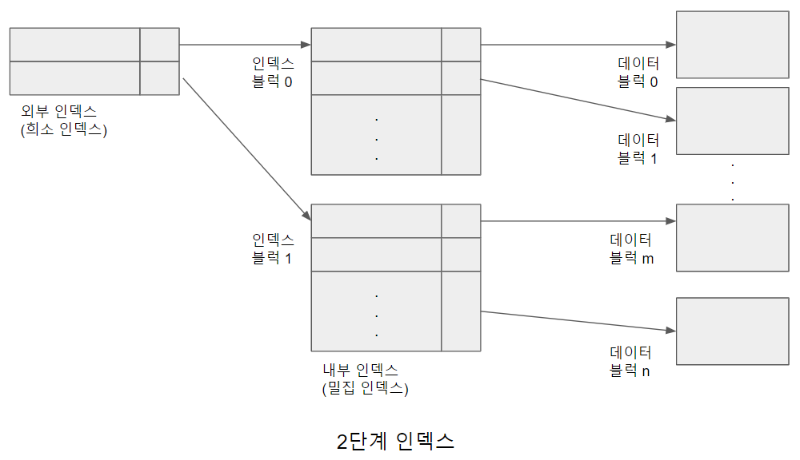

# 다단계 인덱스

 만약 1,000,000개의 레코드에 대하여 밀집 인덱스를 구축한다면, 인덱스 자체의 파일 크기는 크지 않다. 4KB 크기의 한 블럭에 100개의 인덱스 엔트리가 들어갈 수 있다고 가정하면, 전체 인덱스의 크기는 10,000개의 블럭을 차지한다.
 100,000,000개의 레코드에 대해 밀집 인덱스를 유지하기 위해서는 1,000,000개의 블럭 즉 4GB의 공간이 필요하다.

 일반적으로 인덱스는 디스크에 저장되며, 인덱스의 크기가 작아 메모리에 모두 적재될 수 있다면 인덱스 탐색 시간이 짧아서 문제가 되지 않는다. 그러나 인덱스 파일 크기가 위의 예와 같이 메모리 용량보다 커지면 인덱스 사용시 디스크로부터 인덱스 블럭을 읽어 들이는 입출력(I/O) 비용이 증가하여 탐색 시간이 증가하게 된다.

 데이터 접근 비용을 절감하기 위해 밀집 인덱스와 희소 인덱스의 장단점을 적절하게 결합한 다단계 인덱스를 구성할 수 있다. [2단계인덱스.png]와 같이 여러 단계(level)에 걸쳐 인덱스를 구성할 수 있는데, 이를 시계 방향으로 90도 회전하면 트리 모양의 인덱스가 된다. 이때 레코드를 직접 가리키는 인덱스 엔트리의 집합을 내부 인덱스(inner index)라 하고, 내부 인덱스를 가리키는 인덱스 엔트리의 집합을 외부 인덱스(outer index)라고 한다.

 즉 내부 인덱스는 밀집 인덱스로, 외부 인덱스는 희소 인덱스로 구성되어 항상 정렬된 순서로 존재한다. 이와 같이 2개 혹은 그 이상의 단계를 가지는 인덱스를 다단계 인덱스라 한다.

 

 다단계 인덱스는 밀집 인덱스와 희소 인덱스가 결합된 구조이기 때문에 사용자가 원하는 레코드의 위치를 찾기 위해 외부 인덱스에 대해서는 희소 인덱스 방식으로, 내부 인덱스에 대해서는 밀집 인덱스 방식으로 인덱스 블럭을 읽어 들인다. 이를 순서대로 정리하면 다음과 같다.

1. 외부 인덱스에서 원하는 엔트리의 탐색키값보다 작거나 같은 탐색키값 중에서 가장 큰 값을 갖는 인덱스 엔트리를 찾는다.
2. 이 인덱스 엔트리의 포인터가 가리키는 블럭을 적재한다.
3. 내부 인덱스에 도달할 때까지 1 ~ 2 과정을 반복한다.
4. 내부 인덱스에서 조건과 일치하는 인덱스 엔트리의 탐색키를 찾아 데이터 블럭을 메모리에 적재한다.
5. 해당 레코드를 사용자에게 반환한다.

만약 예를 들어 4KB의 한 블럭에 100개 인덱스 엔트리를 저장할 수 있다고 가정 할 경우, 10,000개의 레코드에 대해 내부 인덱스는 레코드와 같은 10,000개의 엔트리를 구성하지만, 외부 인덱스는 오직 100개의 블럭만으로 다단계 인덱스를 구성 할 수 있다. 100,000,000개의 레코드를 가진 릴레이션의 경우 내부 인덱스는 4GB 크기의 100,000,000개 블럭으로 생성되나, 외부 인덱스는 10,000개의 블럭, 즉 40MB의 크기만을 갖는다. 이와 같이 인덱스를 메인 메모리에 적재 할 수 없는 환경이라면 다단계 형태의 인덱스를 생성하는 것이 바람직하다.