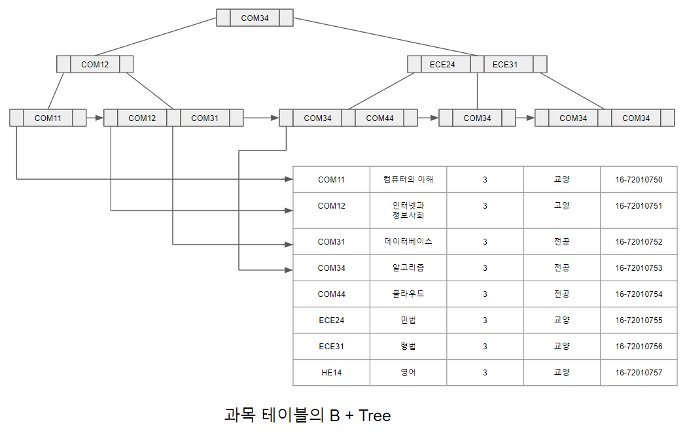

# B + Tree 구조

B + Tree 인덱스는 다단계 인덱스의 일종이지만 앞서 살펴본 순서 인덱스보다 다소 구조가 복잡하다. B + Tree는 이름에서 유추 할 수 있듯이 이진 검색 트리의 확장된 버전이라고 할 수 있다. [B+Tree인덱스.png]에서와 같이 루트 노드(root node)로부터 모든 단말 노드(leaf node)에 이르는 경로의 길이가 같은 높이 균형 트리이다. 단말 노드나 루트 노드가 아닌 그 사이의 노드를 중간 노드(internal node)라 하며, n/2과 n사이의 자식을 갖는다. 이때 n은 노드가 포함 할 수 있는 인덱스 엔트리의 최댓값이다.

[B+Tree인덱스.png]

[일반적인B+Tree노드구조.png]는 일반적인 B + Tree를 구성하는 노드 구조를 나타내며, n - 1개의 탐색키값
k1, k2, ... , kn-1과 자식 노드를 가리키는 n개의 포인터 p1, p2, ..., pn을 포함한다. 노드 안의 탐색키값은 정렬된 순서로 유지되어 있으며, 한 노드에 저장되는 최대 포인터의 개수는 B + Tree의 차수에 의해 결정된다. [일반적인 B + Tree 노드 구조.png]는 차수가 n인 일반적인 B + Tree의 노드이다.

[일반적인B+Tree노드구조.png]

[차수가3인과목파일의B+Tree노드예시.png]

B + Tree에서의 포인터는 자식 노드나 레코드의 저장 위치를 가리킨다. 이때 한 노드가 가질 수 있는 자식 노드의 개수 m은
차수/2 <= m <= 차수를 만족해야 한다. 예를 들어 차수가 3인 B + Tree의 경우 m은 2이상 3이하로, 최소 2개 혹은 최대 3개의 자식 노드를 갖는다. [차수가 3인 과목 파일의 B + Tree 노드 예시.png]의 좌측 노드는 포인터가 2개로 2개의 자식 노드를 가리키며, 우측 노드는 포인터가 3개로 3개의 자식 노드를 가리킨다.

B + Tree는 두 부분으로 구성되어 있는데, 하나는 단말이 아닌 노드로 이루어진 인덱스 세트(index set)이고, 다른 하나는 단말 노드로만 구성된 순차 세트(ordered set)이다. [B+Tree인덱스.png]과 같이 순차 세트에는 모든 탐색키값과 연관된 데이터 레코드가 저장된 주소가 있지만 인덱스 세트에 있는 자식 노드에는 탐색키값만 있다. 인덱스 세트의 탐색키값은 단말 노드에 있는 탐색키값을 신속하게 찾아갈 수 있는 경로를 제공한다. 즉 인덱스 세트에 들어가 있는 여러 포인터의 목적은 데이터가 어디에 있는지 그 범위를 알려주는 목적으로 사용한다.

따라서 인덱스 세트 부분에 있는 탐색키값은 사실상 모두 순차 세트에 다시 나타나게 된다. 반면 순차 세트는 모든 노드가 연결 리스트 형태로 순차적으로 연결되어 있으며, 이것은 파일에 저장된 레코드를 탐색키값 순서에 따라 효율적으로 접근 할 수 있도록 한다.

[BTree생성에사용되는과목테이블.png]

단말 노드의 구조를 살펴보면 i = 1, 2, ... , n - 1 일 때 Pi는 탐색키값 Ki를 가지는 레코드를 가리킨다. 마지막 포인터 Pn은 단말 노드를 탐색키 순서로 연결하기 위해 다음 단말 노드를 가리키는데 사용된다.

[과목테이블의B+Tree.png]

[과목테이블의B+Tree.png]에서 볼 수 있듯이 B + Tree의 비단말 노드(non-terminal node), 즉 루트 노드 및 중간 노드는 최대 n개의 포인터를 가질 수 있고, 최소 차수/2 개 이상의 포인터를 갖고 있어야 한다. 한 노드의 포인터 수를 팬아웃(fanout)이라 하는데, 예외적으로 루트 노드는 다른 비단말 노드와 달리 차수/2 개보다 더 적은 포인터를 가질 수 있다. B + Tree의 특징을 정리하면 다음과 같다.

- 루트는 0, 2 또는 차수/2 에서 차수 사이의 자식 노드(포인터)를 갖는다.
- 루트와 단말 노드를 제외한 모든 노드는 최소 차수/2 에서 차수 개 사이의 자식 노드를 갖는다.
- 모든 단말 노드는 같은 레벨에 있따. 즉 루트로부터 같은 거리에 있다.
- 단말 노드가 아닌 노드에 있는 탐색키값의 수는 그 노드의 자식 노드 수보다 하나 적다.
- 단말 노드는 데이터 파일의 순차 세트를 나타내며, 모두 리스트로 연결되어 있다.
- 단말 노드는 적어도 (차수 - 1)/2 개의 탐색키값을 포함해야 한다.