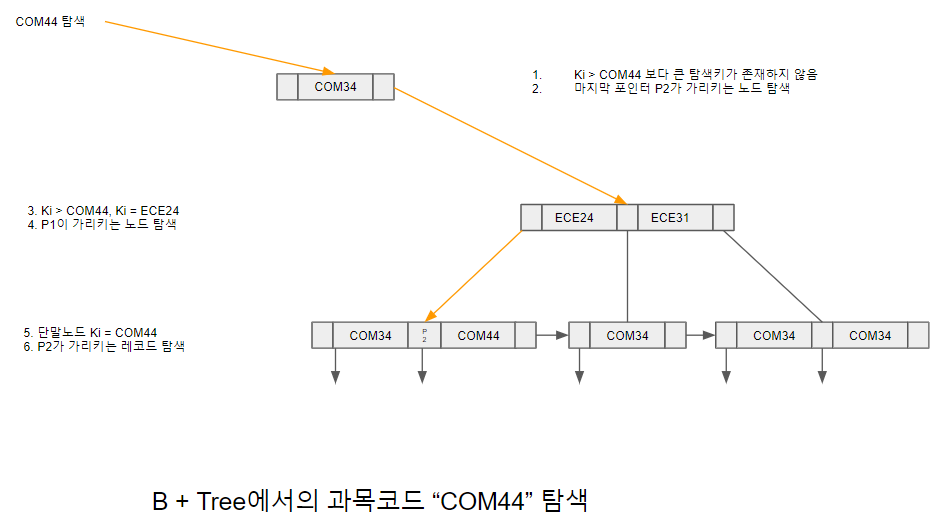

# B + Tree 에서 검색 연산

특정 탐색키값에 대한 B + Tree 검색 연산은 인덱스 세트를 거쳐 순차 세트에 도달하여 탐색키에 해당하는 레코드 포인터를 획득하는 것으로 종료된다. 검색 알고리즘은 트리의 루트부터 시작해서 단말 노드에 도달 할 때까지 아래 방향으로 다음과 같은 단계를 반복하며 이루어진다. 탐색키값 V에 대한 검색 연산을 수행 할 때 하나의 노드에 m개의 포인터가 존재한다고 가정하고, 현재의 노드를 N이라고 가정 한다. 초기의 N은 루트 노드이다.

단계 1 : 현재 탐색 대상인 N을 조사하여 V와 같거나 큰 탐색키 중 가장 작은 키 Ki를 찾는다.

단계 2 : 아래의 조건에 따라 다음 노드를 결정한다.
        1. Ki = V 일 경우, 포인터 Pi+1이 가리키는 노드를 N으로 결정
        2. Ki > V 일 경우, Pi가 가리키는 노드를 N으로 결정
        3. V보다 큰 탐색키가 없는 경우, 노드 내의 NULL이 아닌 마지막 포인터가 가리키는 노드를 N으로 결정

단계 3 : N이 단말 노드가 아니면, 단계 1부터 반복한다. N이 단말 노드일 경우 탐색키값 Ki와 V가 같은 포인터 Pi를 반환한다.

만약 검색 알고리즘을 통해 단말 노드에서 V를 찾지 못하면, V를 가지는 레코드는 존재하지 않음을 의미한다.

[B + Tree에서의 과목코드 "COM44" 탐색.png]

레코드가 삽입 또는 삭제되면 새로운 탐색키 또는 삭제된 탐색키에 대한 인덱스 엔트리를 B + Tree에 반영해야 한다. 레코드에 대한 수정은 일련의 레코드의 삭제와 새로운 레코드의 삽입 연산의 연속으로 볼 수 있다. 삽입 연산은 노드에서 유지해야 할 탐색키값과 포인터 수 증가로 인해 노드를 분할(split)해야 하는 경우가 생기며, 삭제 연산은 노드에서 유지해야 할 탐색키값과 포인터 수 감소로 인해 노드를 주변 노드와 병합(merge)해야 하는 경우가 발생한다. 이 때문에 일반적인 검색 연산보다는 복잡한다. 또한 하나의 노드가 단순 분할 되거나 병합되면 B + Tree의 높이 균형을 유지하기 어려워지기 때문에 높이 균형을 유지하는 알고리즘이 필요하다.