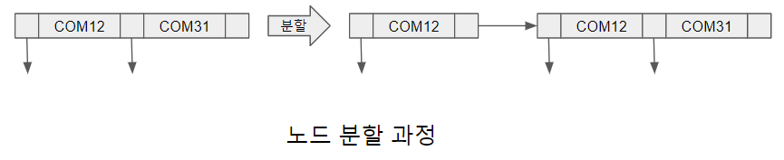

# B + Tree 에서 삽입 연산

우선 분할과 병합이 발생하지 않는 삽입 과정은 검색과 같은 방법으로 삽입되는 레코드의 탐색키값이 속해야 할 단말 노드를 찾는 과정과 그 단말 노드에 탐색키값과 레코드 포인터 쌍(엔트리)을 삽입하는 과정으로 구성된다. 이때 삽입 후에도 노드 내에서 탐색키가 순서를 유지하도록 해야한다.

삽입 과정은 새로운 탐색키값을 저장해야 할 노드에 빈 공간이 남아 있을 경우 노드를 수정하는 간단한 과정으로 삽입 처리 할 수 있다.
그러나 노드에 저장 공간이 없을 경우 분할이라는 새로운 노드를 생성하여 B + Tree에 삽입하는 과정이 동반된다. 기술적으로 분할하는 방법은 오름차순으로 정렬된 탐색키와 포인터에서 첫 차수/2 개의 키는 기존 노드에 두고 나머지 키는 새로 만들어진 형제 노드에 넣는 것이다.

[과목테이블의B+Tree.png]

예를 들어 새로운 과목을 개설할 때 과목코드가 "COM24"인 새로운 레코드가 삽입된다고 가정하자. [과목테이블의B+Tree.png] 에서 "COM24"가 삽입되어야 하는 노드를 검색 알고리즘을 통해 찾으면 "COM12", "COM31"을 포함하는 노드라는 것을 알 수 있다.

하지만 차수가 3인 B + Tree에서 해당 단말 노드는 더 이상 탐색키값을 저장 할 공간이 없으므로 이 노드는 분할되어 새로운 탐색키를 저장할 공간을 확보한다. [노드분할과정.png]는 B + Tree에 "COM24"를 삽입하고 단말 노드의 분할로부터 생긴 두 단말 노드를 보여 준다.

[노드분할과정.png]

단말 노드가 분할되면 새로 만들어진 단말 노드를 부모 노드에 연결해야 한다. 새로 만들어진 노드의 가장 작음 탐색키값인 "COM24"는 "COM12" 하나만 저장하고 있는 부모 노드에 노드 분할이 없이 바로 추가 할 수 있다. 그 이유는 B + Tree의 차수가 3이며, 기존의 노드는 포인터 2개만 갖고 있기 때문이다. 따라서 키 값 "COM12"와 "COM24"를 갖고 자식 노드 3개를 가리키는 포인터를 가진 중간 노드로 [그림 9-13]과 같이 수정된다.

그러나 부모 노드에 새로운 키값과 포인터를 추가 할 공간이 없다면, 단말 노드에서 수행한 분할 작업을 다시 부모 노드 레벨에서 수행해야 하며, 연쇄적으로 루트 노드에 이르는 모든 노드가 분할되기도 한다. 상황에 따라서는 트리의 높이가 달라지는 상황도 발생 할 수 있다.

[과목코드 “COM24” 삽입에 따른 단말 노드 분할.png]
