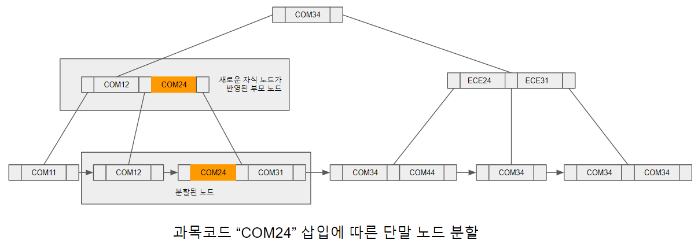
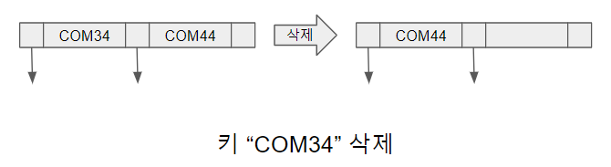
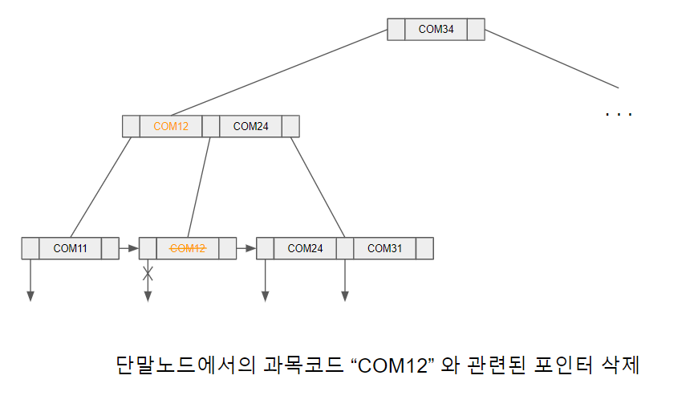
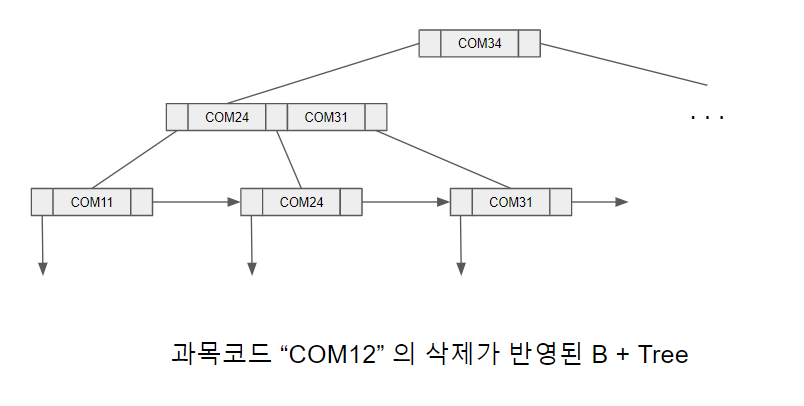

# B + Tree 에서 삭제 연산

삭제 연산 과정은 우선 삭제 할 대상 노드를 검색 할 때와 같은 방법을 사용하여 찾는 것으로 시작된다. 삭제 할 레코드의 탐색키를 통해 삭제될 탐색키와 포인터를 포함하는 단말 노드를 찾고 해당 탐색키와 포인터를 삭제한다. 이떄 중복이 허용되는 탐색키에 대해서는 같은 탐색키값을 가지는 복수 개의 인덱스 엔트리가 존재하기 때문에 삭제될 레코드를 가리키는 엔트리를 재검색하여 모든 엔트리들을 찾고 단말 노드에서 제거한다.

[과목코드 “COM24” 삽입에 따른 단말 노드 분할.png]

단말 노드에서 제거된 엔트리의 오른쪽에 있는 모든 엔트리들은 빈 공간이 발생하지 않도록 왼쪽으로 이동시킨다. 예를 들어 [과목코드“COM24”삽입에따른단말노드분할.png]에서 과목코드 "COM34"에 해당하는 레코드가 삭제되면 검색 연산을 통해 [키"COM34"삭제.png]의 노드를 찾아 "COM34"를 제거하고 오른쪽에 위치한 모든 엔트리를 왼쪽으로 이동시킨다.

[키"COM34"삭제.png]

그러나 [과목코드“COM24”삽입에따른단말노드분할.png]의 B + Tree에서 과목코드 "COM12"를 삭제한다고 가정하면 상황이 달라진다. 우선 탐색을 통해 단말 노드로 이동하여 탐색키 "COM12"와 연관된 포인터를 삭제하면[단말노드에서의과목코드"COM12"와관련포인터삭제.png]와 같이 노드가 공백 상태가 되거나 노드 유지 조건인 (차수 - 1)/2 개의 키값을 갖지 못하게 되어 노드를 없애거나 주변 노드와 추가적 작업을 해야 하는 상황이 발생한다. 이 경우 B + Tree는 다음 두가지 중 한가지를 실행한다.

- 다음 이웃 단말 노드의 키를 재분배 : 다음 이웃 노드가 (차수 - 1)/2개 보다 많은 키를 갖고 있는경우
- 당므 이웃 단말 노드와의 병합 : 키 재분배 후, 다음 이웃 노드도 (차수 - 1)/2 보다 적은 키값을 갖게 되는 경우

[단말노드에서의 과목코드 "COM12"와 관련 포인터 삭제.png]

[단말노드에서의과목코드"COM12"와관련포인터삭제.png]에서는 삭제된 단말 노드의 다음 이웃 노드는 "COM24"와 "COM31" 키값을 갖고 있으며, 키를 재분배 하더라도 (차수 - 1)/2 보다 적어지지 않는다. 따라서 "COM12"가 삭제된 단말 노드에 "COM24"를 분배해 주고, 부모 노드에 재분배로 인한 키값의 변화를 반영한다. 부모 노드의 키 Ki 값은 Pi+1이 가리키는 노드의 가장 작은 값의 키로 수정된다. 이를 모두 수행하면 [과목코드"COM12"의삭제가반영된B+Tree.png]과 같은 결과를 얻게 된다.

[과목코드"COM12"의삭제가반영된B+Tree.png]
