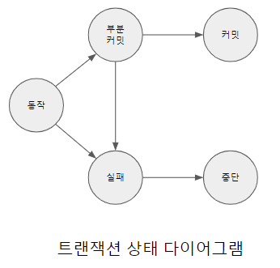

# 트랜잭션의 상태

ACID 특성을 보장하기 위해 트랜잭션은 처리 과정에서 여러 가지 상태로 전환된다. 트랜잭션이 성공적으로 수행되면 이를 커밋(commit)되었다고 한다. 트랜잭션이 커밋되면 갱신된 값을 반영하고, 데이터베이스는 이 상태를 일관된 상태로 유지한다.

반면 트랜잭션이 실행되다가 예기치 못한 오류로 인하여 성공적으로 완료되지 못하는 경우가 있는데 이를 트랜잭션이 중단(aborted)되었다고 표현한다. 트랜잭션이 중단되었을 경우 데이터베이스는 원자성 유지를 위해 트랜잭션이 중단되기 직전까지 실행되었던 연산을 이전 상태로 복구해야 한다.

이와 같이 트랜잭션이 중단되기 이전까지 수행한 연산에 의해 변경된 내용을 무효화 하는 과정을 롤백(rollback)이라고 한다. 즉 트랜잭션 실행의 성공과 실패에 따라 DBMS는 서로 다르게 대응해야 하며, 대응 과정에 따라 [트랜잭션상태다이어그램.png]과 같은 다섯 가지 가운데 하나의 상태로 전환하면서 최종적으로 종료된다.

[트랜잭션상태다이어그램.png]

동작(active) : 트랜잭션의 초기 상태로 트랜잭션이 실행을 시작하였거나 실행 중인 상태
트랜잭션이 어떤 사용자가 내 계좌에서 친구의 계좌로 계좌이체 해줘 라고 요청이 들어오면 즉 SQL로 요청이 들어오면 DBMS는 이 작업을 처리하기 위해 여러 작업 처리 절차를 만들어 낸다. 이런 것들이 DBMS에 있는 내부 엔진에 전달되어서 처리되기 바로 직전 또는 처리되고난 직후의 상태를 "동작"상태 라고 한다.

부분 커밋(partially committed) : 트랜잭션이 마지막 명령문을 실행한 직후, 갱신된 데이터가 메모리상에만 존재하고 데이터베이스에는 반영되지 않은 상태, 이 상태에서 시스템에 오류가 발생한다면 메모리에 있던 데이터만 손실되고 실패 상태로 전환하며, 만약 정상적으로 완료되면 커밋 상태로 전환될 수 있는 상태(마지막 연산을 실행한 직후의 상태)

실패(failed) : 정상적으로 트랜잭션 실행이 진행될 수 없는 상태로, 현재까지 트랜잭션에서 실행된 모든 연산을 트랜잭션이 시작되기 이전의 상태로 롤백해야 하는 상태

커밋(committed) : 트랜잭션이 성공적으로 실행을 완료하고 갱신된 데이터가 데이터베이스에 반영되어 종료된 상태

중단(aborted) : 트랜잭션의 실행이 실패하여 롤백되어 트랜잭션이 시작되기전으로 환원되고 트랜잭션이 종료된 상태