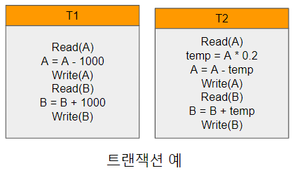
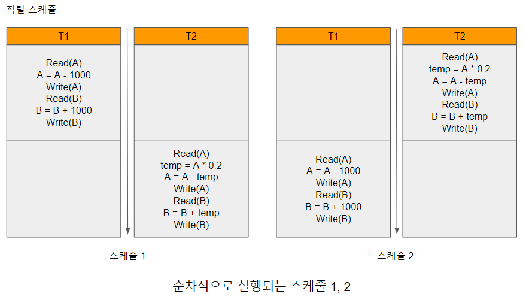
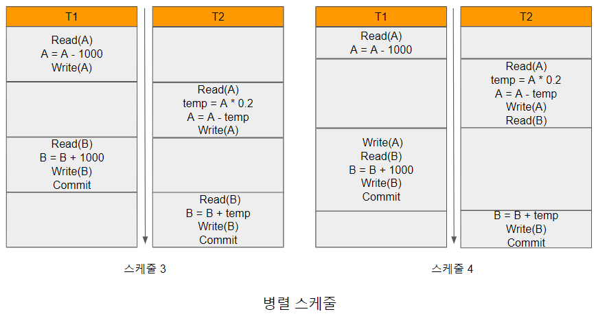

# 트랜잭션의 동시성

데이터베이스는 다수의 사용자가 공동으로 사용하기 위해 통합, 저장된 데이터의 집합이므로 데이터베이스 운용 중에 DBMS는 다수의 사용자로부터 여러 트랜잭션을 요청받는다. 따라서 다수의 요청에 대한 응답 시간을 최소화하여 사용자의 만족도를 향상시키기 위해서는 트랜잭션의 동시 처리율을 최대화하는 것이 필수적이다.

이점
- 트랜잭션의 처리율과 자원의 이용률을 향상시킬 수 있다. 하나의 트랜잭션은 처리 과정에서 다수의 데이터 입출력 및 CPU를 동반하는데, 이 과정에서 발생하는 대기 시간에 다른 트랜잭션의 데이터 입출력 및 CPU 이용을 처리하여 동시에 처리되는 트랜잭션의 수를 늘릴 수 있다. 이를 통해 트랜잭션의 처리율을 높이고 자원의 효율적 사용이 가능해진다.

- 트랜잭션의 대기 시간을 감소시킬 수 있다. 순차적 트랜잭션 실행시 실행 시간이 긴 트랜잭션이 먼저 실행되고 짧은 트랜잭션이 나중에 실행 되었을 경우, 전채적 대기 시간이 증가한다. 따라서 다수의 트랜잭션이 동시에 수행되면 트랜잭션의 대기 시간을 감소시킬 수 있고, 이로 인해 트랜잭션이 요청된 시간부터 완료되는 때까지 걸리는 응답 시간을 줄일 수 있다.

이러한 이점에도 불구하고 다수의 트랜잭션이 동시에 하나의 데이터를 갱신하면 데이터의 일관성을 유지하는데 문제가 발생할 가능성이 있다. 따라서 다중 사용자 환경을 지원하는 데이터베이스 시스템에서 다수의 트랜잭션이 일관성을 유지하면서 성공적으로 동시에 실행될 수 있도록 지원하는 기능이 필요한데, 이를 동시성 제어(concurrency control)라고 한다.

[트랜잭션의예.png]

[트랜잭션의예.png]과 같이 계좌 A에는 10,000원, B에는 20,000원이 있을 때, 계좌 A에서 계좌 B로 1,000원을 이체하는 트랜잭션 T1과, 계좌 A에서잔고의 20%를 계좌 B로 이체하는트랜잭션 T2가 요청되었다고 가정해 보자. T1과 T2가 순차적으로 실행되는 상황은 [순차적으로실행되는스케줄.png]와 같이 두 가지가 있다.

[순차적으로실행되는스케줄.png]

이와 같이 트랜잭션에 포함된 연산의 실제 실행 순서를 나타낸 것을 스케줄(schedule)이라고 한다. [순차적으로실행되는스케줄.png]의 스케줄 1의 순서로 명령이 실행되면 최종 결과로 계좌 A에는 7,200원, 계좌 B에는 22,800원이 잔고가 되고, 이 두 계좌의 합은 두 트랜잭션이 수행되기 이전의 잔고의 합과 일치해야 한다. 스케줄 2의 방법으로는 T2가 T1보다 먼저 실행되어 계좌 A에는 7,000원 계좌 B에는 23,000원이 잔고가 된다. 마찬가지로 두 계좌의 합은 트랜잭션이 수행되기 이전의 잔고의 합과 일치 한다.

[병렬스케줄.png]

[순차적으로실행되는스케줄.png]의 스케줄 1, 2와 같이 트랜잭션에 포함된 연산이 다른 트랜잭션의 연산과 섞여서 실행되는 것이 아니라, 각 트랜잭션에 속한 모든 연산이 순차적으로 실행되는 스케줄을 직렬 스케줄(serial schedule)라고 한다. 직렬 스케줄과는 다르게 [병렬스케줄.png]의 스케줄 3과 같이 하나의 트랜잭션이 완료되기 전에 다른 트랜잭션이 실행되는 스케줄을 병렬 스케줄(parallel schedule)이라고 한다. 

[병렬스케줄.png]의 스케줄 3은 실행되면 직렬 스케줄의 결과와 동일하지만, 병렬 스케줄 4는 올바른 결과를 생성하지 않는다. 예를 들어 [병렬스케줄.png]의 스케줄 4를 실행하면 계좌A는 9000원, 계좌 B는 22,000원이 되어 두 계좌의 합이 실행 이전보다 1,000원 추가되는 일관성이 훼손된 결과를 생성한다. 따라서 DBMS는 스케줄 4와 같이 비일관된 상태를 유발하는 스케줄이 생성되지 않도록 실행순서를 조정할 필요가 있다.