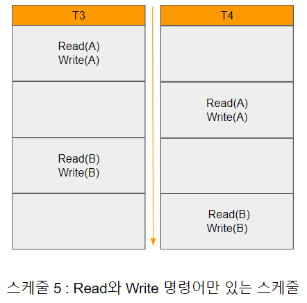
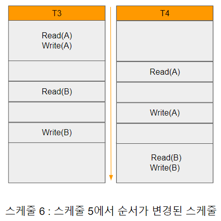
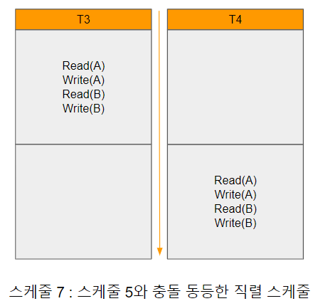

# 트랜잭션의 직렬화

트랜잭션은 시스템 일관성 상태에서 새로운 일관성 상태로 변화시켜야 하기 때문에 스케줄이 비일관된 상태를 유발시키는지 여부를 확인하여야 한다.

[스케줄5:Read와Write명령어만있는스케줄.png]

다수의 트랜잭션이 동시에 수행된 결과가 직렬 스케줄의 결과와 동일한 스케줄을 직렬 가능 스케줄(serializable schedule)이라고 하며, 일관성을 유지할 수 있는 스케줄이다. 

트랜잭션의 직렬화(serialization)를 보다 구체적으로 설명하기 위해 [스케줄5:Read와Write명령어만있는스케줄.png]과 같이 간단한 Read, Write 연산으로만 구성된 스케줄을 보면 2개의 트랜잭션 Ti, Tj가 있을 때 Ii는 Ti에 포함된 연산이고, Ij를 Tj에 포함된 연산이라고 가정 했을 때, 만약 Ii와 Ij가 서로 다른 데이터 항목에 접근한다면 그 스케줄에 있는 다른 연산에 영향을 주지 않으므로 연산의 순서를 바꾸어도 상관없다.

그러나 두 연산이 같은 데이터 항목 Q에 접근한다면 명령어의 순서에 따라 결과가 달라질 수 있다. 트랜잭션에서 두 연산 Read와 Write만을 사용한다면 4가지 상황이 발생 할 수 있다.

1. Ii = Read(Q), Ij = Read(Q) : Ii와 Ij는 데이터 항목 Q의 값을 읽기만 하기 때문에 두 연산의 순서는 상관없다.
2. Ii = Read(Q), Ij = Write(Q) : Ii가 Ij보다 먼저 실행되면 Ti가 가지는 Q의 값은 명령어 Ij가 있는 트랜잭션 Tj가 기록한 Q값과 다르다. 만약 Ij가 Ii보다 먼저 나온다면Ti는 Tj가 기록한 값을 가지게 되므로 해당 순서는 문제가 된다.
3. Ii = Write(Q), Ij = Read(Q) : Ii와 Ij의 순서는 2번과 마찬가지로 문제가 된다.
4. Ii = Write(Q), Ij = Write(Q) : 이 경우에는 둘 다 Write 연산을 하므로 나중에 실행된 Write 연산 결과만 남게 되고, 먼저 실행된 Write 연산 결과는 사라지게 된다. 따라서 두 연산 중 하나의 실행 결과만이 데이터베이스에 기록되고, 이는 다음에 오는 Read(Q)의 값에 영향을 준다.

2, 3, 4와 같이 데이터 항목에 대하여 서로 다른 트랜잭션이 연산을 수행 할 때, 최소 하나의 연산이 Write연산일 경우 Ti와 Tj는 서로 충돌(conflict)한다고 한다. 서로 충돌하는 경우에는 실행 순서를 교환 할 수 없다. 따라서 Ii와 Ij가 모두 Read 연산일 경우에만 실행 순서를 임의로 정할 수 있다.

[스케줄5:Read와Write명령어만있는스케줄.png]에서 T3의 Write(A)와 T4의 Read(A)는 충돌한다. 하지만 T4의 Write(A)와 T3의 Read(B)는 서로 다른 데이터에 접근하고 있기 때문에 충돌하지 않는다.

[스케줄6:스케줄5에서순서가변경된스케줄.png]

따라서 [스케줄5:Read와Write명령어만있는스케줄.png]의 수케줄에서 T4의 Write(A)와 T3의 Read(B)는 순서를 바꿔서 [스케줄6:스케줄5에서순서가변경된스케줄.png]과 같은 새로운 스케줄을 만들 수 있다. 그리고 T4의 Write(A)와 T3의 Read(B)의 순서 외에도 서로 순서를 교환 할 수 있는 연산이 더 있다.

- 트랜잭션 T3의 Read(B)와 T4의 Read(A)를 바꾼다.
- 트랜잭션 T3의 Write(B)와 T4의 Write(A)를 바꾼다.
- 트랜잭션 T3의 Write(B)와 T4의 Read(A)를 바꾼다.

[스케줄7:스케줄5와충돌동등한직렬스케줄.png]

앞에 제시한 3개의 순서 교환이 가능한 연산을 실제로 모두 교환 한다면
[스케줄7:스케줄5와충돌동등한직렬스케줄.png]과 같은 스케줄을 얻게 되는데 이는 T3와 T4에 대한 직렬 스케줄의 연산과 동일하다. 이러한 동등성은 [스케줄5:Read와Write명령어만있는스케줄.png]의 스케줄 5와 [스케줄6:스케줄5에서순서가변경된스케줄.png]의 스케줄 6은 동등하다는 것이며, 순차적인 스케줄과 동일한 최종 상태를 만든다.

이와 같이 특정 스케줄 S가 있을때 충돌이 일어나지 않는 연산의 순서를 바꿔서 스케줄 S'으로 변환 할 수 있다면 S와 S'은 충돌 동등(conflict equivalent)하다고 말한다.

충돌 동등 개념은 충돌 직렬성(conflict serializability)이라는 개념으로 확장된다. 만약 어떤 스케줄 S가 직렬 스케줄과 충돌 동등하면 스케줄 S를 충돌 직렬적(conflict serialization)이라고 말한다.

즉 임의의 두 스케줄에서 충돌이 일어나지 않는 연산의 순서를 바꾸어 각 트랜잭션을 순차적으로 실행하는 것과 같이 변경 할 수 있다면 "충돌 직렬적이다."라고 말 할 수 있다. 그러므로 [스케줄5:Read와Write명령어만있는스케줄.png]의 스케줄 5는 [스케줄7:스케줄5와충돌동등한직렬스케줄.png]의 직렬 스케줄과 동등하기 때문에 충돌 직렬성을 가진다.