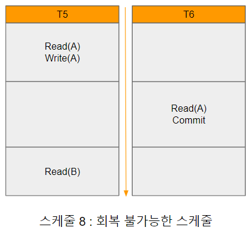
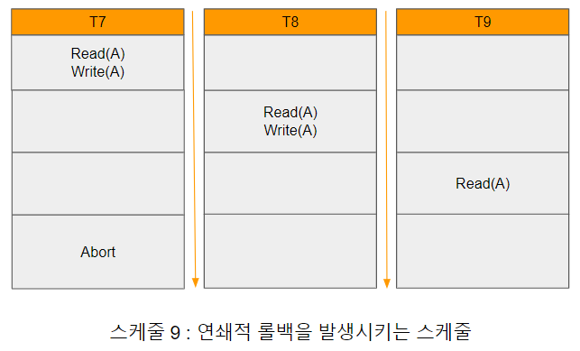

# 트랜잭션의 회복화

트랜잭션의 동시 실행이 데이터베이스에 어떠한 영향을 미치는가? 앞에서 살펴보았듯이 만약 트랜잭션 Ti가 실패하면, 트랜잭션의 원자성을 보장하기 위해 트랜잭션이 시작된 후 실패하기 전까지 실행되었던 모든 연산을 트랜잭션이 시작되기 이전 상태로 회복시켜야 한다. 이는 단일 트랜잭션뿐만 아니라 동시에 실행되는 트랜잭션 중에서 어떤 트랜잭션 Ti에 종속적인 트랜잭션 Tj 또한 정상적으로 중단될 수 있도록 보장해야 한다. 이러한 상황에서도 데이터의 일관성을 보증하기 위해 시스템에서 수행하는 스케줄의 형태에 제한을 가할 필요가 있다.

[스케줄8회복불가능한스케줄.png]

독립적으로 수행되는 트랜잭션이라도 데이터에 대한 접근 순서에 따라 트랜잭션 간 종속성이 발생 할 수 있다. [스케줄8회복불가능한스케줄.png]의 스케줄 8에서 T5는 커밋 또는 중단 명령이 없는 부분 스케줄(partial schedule)이고, T6은 Read(A) 명령어만 수행하는 트랜잭션이다.

이 스케줄의 특징은 T5가 Read(A)와 Write(A)를 수행하고 아직 동작 중인 상태에서 T6이 Read(A)를 수행한 후 곧바로 커밋한다는 점이다. 이와 같은 T6을 T5에 종속적(dependent)이라고 한다. 만약 T5에 오류가 발생하여 트랜잭션을 롤백해야 한다면 종속성으로 인한 문제가 발생한다.

원자성을 보장하기 위해서는 T6도 취소해야 하지만 T6이 커밋된 이후이기 때문에 취소가 불가능하다. 따라서 T5가 실패하더라도 회복 할 수 없는 상황이 되었다. 즉 스케줄 8은 회복 불가능한 스케줄(nonrecoverable schedule)의 예이다. 이와 반대로 회복 가능한 스케줄(recoverable schedule)이란 모든 트랜잭션 순서쌍 Ti와 Tj에 대해 Ti가 기록한 데이터 항목을 Tj가 읽는다면 Ti의 커밋이 Tj의 커밋보다 먼저 나타나는 스케줄을 말한다.

따라서 스케줄 8에서 오류가 발생하더라도 회복을 가능하게 하기 위해서는 T6은 T5가 커밋을 완료할 때까지 커밋을 지연해야 한다.

[스케줄9연쇄적롤백을발생시키는스케줄.png]

회복 가능한 스케줄이어도 트랜잭션 Ti가 실패하여 회복하기 위해서는 여러 트랜잭션을 회복시켜야 하는 경우도 발생 할 수 있다. 다른 트랜잭션을 회복해야 하는 상황은 실패가 일어난 트랜잭션 Ti가 기록한 값을 다른 트랜잭션에서 읽었을 때 발생한다. [스케줄9연쇄적롤백을발생시키는스케줄.png]의 부분 스케줄 9를 보면 트랜잭션 T7은 Write(A)를 통해 A값을 기록한다. 트랜잭션 T8은 T7이 기록한 A값을 읽은 다음 Write(A)를 통해 A의 값을 기록한다. 트랜잭션 T9는 T8이 기록한 A값을 읽는다.

만약 이때 T7이 실패한다면 T7은 롤백되어야 한다. 그런데 T8은 T7에 종속적이기 때문에 T8도 롤백되어야 한다. T9도 T8에 종속적이기 때문에 T9도 롤백되어야 한다. 이와 같이 하나의 트랜잭션이 롤백됨으로써 다른 트랜잭션도 롤백되어야 하는 현상을 연쇄적 롤백(cascading rollback)이라고 한다.

연쇄적 롤백은 많은 연산을 동반하기 때문에 연쇄적 롤백이 일어나지 않도록 스케줄에 제한을 둬야 한다. 이와 같이 연쇄적이지 않은 스케줄이 구성된 것을 비연쇄적인 스케줄(cascadeless schedule)이라고 한다. 비연쇄적인 스케줄은 모든 트랜잭션 순서쌍 Ti와 Tj에 대해 Ti가 기록한 데이터 항목을 읽는다면 Ti의 커밋이 Tj의 읽기 연산보다 먼저 나타나는 스케줄을 말하며, 모든 비연쇄적인 스케줄은 회복 가능하다.