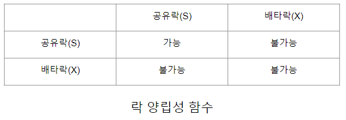
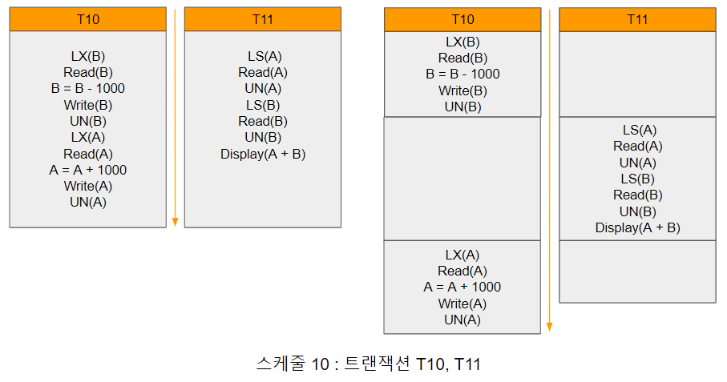
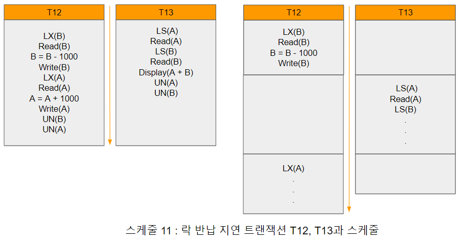

# 락 기반 규약

락 기반 규약은 각 데이터 항목마다 락(lock)을 두고 각 트랜잭션이 일정한 규칙인 락킹 프로토콜(locking protocol)에 맞추어 락을 획득하고 반납하도록 규정하는 기법을 말한다.

1. 공유락(shared lock) : 트랜잭션 T가 데이터 항목 Q에 공유하는 형태의 락을 얻으면(S로 표기), 트랜잭션 T는 데이터 항목 Q를 읽을 수는 있으나 쓸 수는 없다.

2. 배타락(exclusive lock) : 트랜잭션 T가 데이터 항목 Q에 대한 배타 형태의 락을 얻으면(X로 표기), 트랜잭션 T는 데이터 항목 Q를 읽고 쓸 수 있다.

락 기반 규약을 사용하는 시스템에서 모든 트랜잭션은 데이터 항목 Q에 실행 할 연산 종류에 따라 동시성 제어 관리 모듈에 공유 또는 배타 락을 요새 청하고 획득해야만 연산을 진행 할 수 있다. 각 데이터 항목에는 여러 락이 요청될 수 있는데, 락의 종류에 따라 [락양립성함수.png]와 같은 양립성 함수(compatibility function)를 통해 동시에 수락될 수 있는지 판단한다.

[락양립성함수.png]

공유락은 다른 공유 락과 양립 할 수 있지만 배타락과는 양립 할 수 없다. 반면 특정 데이터에 대한 공유 락은 서로 다른 트랜잭션에 의해 동시에 소유될 수 있다. 만약 양립될 수 없는 락 요청은 먼저 락을 소유한 트랜잭션이 락을 반납 할 때까지 기다려야 한다.

락 기반 규약에서 트랜잭션은 다음의 세 명령으로 데이터에 대한 락을 요청 및 반납한다.

- LS(Q) : 데이터 Q에 대한 공유 락을 요청한다.
- LX(Q) : 데이터 Q에 대한 배타 락을 요청한다.
- UN(Q) : 데이터 Q에 대한 공유/배타 락을 반납한다.

트랜잭션이 락을 사용하는 방법으로 크게 두가지를 생각해 볼 수 있다. 첫번째는 데이터에 대한 접근이 끝난 직후에 데이터에 대한 락을 바로 반납하는 방법이 있다. 두번째는 트랜잭션이 데이터에 접근하고 있는 동안에는 그 데이터에 대한 락을 계속 소유하고 있는 방법이 있다.

우선 트랜잭션이 데이터에 접근한 직후 락을 반납하는 경우에 발생 할 수 있는 문제를 살펴보기 위해 [트랜잭션T10,T11과스케줄11.png]
와 같은 왼쪽의 두 트랜잭션, 계좌 B에서 계좌 A로 1,000원을 이체하는 T10과 두 계좌 잔핵의 합을 출력하는 T11을 예로 들면

[트랜잭션T10, T11과 스케줄10.png]

계좌 A와 B의 초기 잔액은 각각 10,000원과 20,000원이라고 가정한다.
트랜잭션 T10과 T11이 순차적으로 실행되면(T10 -> T11 || T11 -> T10), 트랜잭션 T11은 30,000원을 출력한다. 그러나 두 트랜잭션을 동시에 실행하는 [트랜잭션T10,T11과스케줄10.png]의 스케줄 10에서 트랜잭션 T11은 정확하지 않은 값인 29,000원을 출력한다. 이와 같은 문제가 발생한 원인은 트랜잭션 T10이 데이터 B에 대한 락을 너무 일찍 반납하여 비일관적인 상태에서 T11이 B항목에 접근 할 수 있었기 때문이다. 

[락 반납 지연 트랜잭션T12, T13과 스케줄11.png]

반대로 락 반납이 트랜잭션 후반까지 지연시킨 [락반납지연트랜잭션T12,T13과스케줄11.png]의 T12, T13과 이를 동시 실행한 부분 스케줄 11을 살펴보면, T12가 B에 대한 배타 락을 확보한 이후에 T13이 B에 대한 공유 락을 요청하므로 T12가 배타 락을 반납 할 때까지 대기해야 한다.

반면 T13이 A에 대해 공유 락을 확보한 이후에 T12가 A에 배타 락을 요청하므로 T13이 A에 대한 락을 반납 할 때까지 T12는 기다려야 한다. 따라서 두 트랜잭션 모두가 대기 상태로 전환되어 정상적인 실행이 불가능한 교착상태(deadlock)가 발생하고 더 이상 진행이 불가능하여 두 트랜잭션 중 하나를 롤백(rollback)시켜야 한다.

데이터에 대한 락을 가능한 한 빨리 반납함으로써 동시성을 최대화하려는 경우에 비일관적인 상태에 놓일 수 있으며, 반대로 데이터에 대한 락 반납을 지연시키면 교착상태가 발생 할 수 있다.

따라서 시스템 내의 모든 트랜잭션은 각 데이터에 대한 락을 얻고 반납 할 적절한 시기는 결정하는 락킹 규약(locking protocol)이 필요하다. 락킹 규약으로 직렬성이 있는 스케줄만 허용하기 때문에 가능한 스케줄 수가 제한된다. 우선 여러가지 락킹 규약을 보기전에 몇가지 사항을 보면

{T0, T1, T2 ..., Tn}을 스케줄 S에 참여하는 트랜잭션의 집합이라고 했을 때 S에 포함된 임의의 트랜잭션 Ti가 데이터 항목 Q에 대한 A락을 소유하고, 이후에 트랜잭션 Tj가 Q에 대해 B락을 소유하면서 COMP(A, B) = "불가능"이면 Ti가 Tj에 선행한다고 하며 Ti -> Tj로 표기한다. Ti -> Tj는 동등한 연산 순서를 가지는 모든 스케줄에서 Ti가 Tj에 우선해야 한다는 의미이다.

스케줄 S가 락킹 규약을 준수하는 트랜잭션에 대한 스케줄이면, S는 주어진 락킹 규약하에서 적법한 스케줄(legal schedule)라고 한다.
또한 모든 적법한 스케줄에서의 각 트랜잭션들에 대해 "->"관계가 사이클을 포함하지 않으면 락킹 규약은 충돌 직렬성을 보장한다고 할 수 있다.